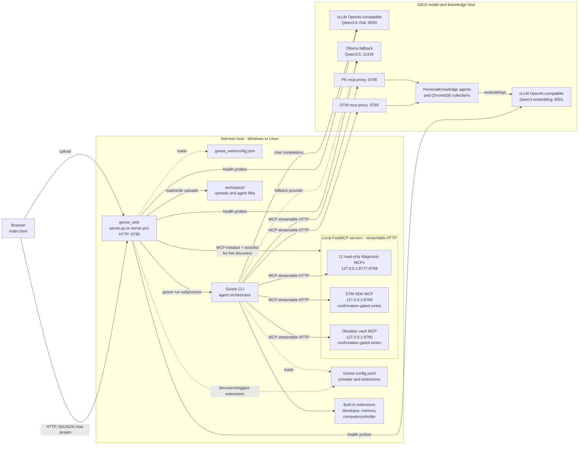
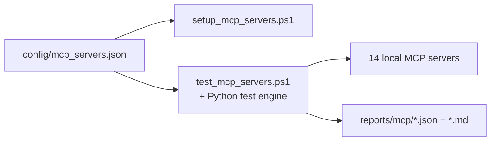
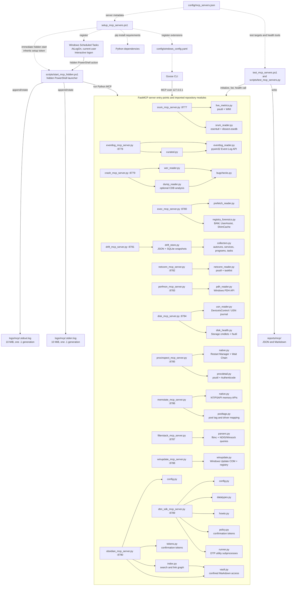
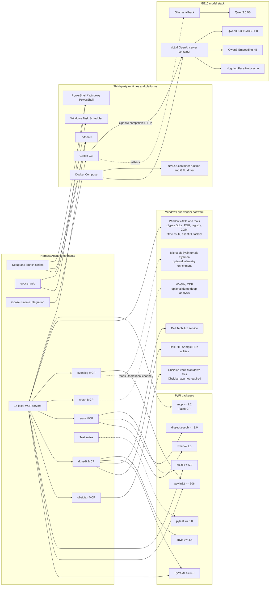

# HarnessAgent module and third-party relationships

This document reflects the implementation and versioned configuration currently in
this repository. Solid arrows are runtime calls or imports; dashed arrows are
configuration, installation, optional, or test-only relationships.

## 1. Runtime architecture

## 2. Repository module relationships

The shared manifest drives installation and the non-privileged batch-test client:

The immediate-start edge inherits the setup process token. Because suite setup runs elevated, an
install-time Obsidian process is elevated even though its Scheduled Task remains `RunLevel Limited`.
Obsidian returns to an unelevated token when restarted through that task or at the next logon.

## 3. Third-party software relationships

Notes:

- `goose_web/server.py` is standard-library only. Its PowerShell counterpart uses
  .NET `HttpListener`; these are alternative implementations of the same HTTP API.
- All local MCPs use the `mcp` Python SDK's `FastMCP` and streamable HTTP. Package
  edges above are aggregated: only SRUM, netconn, and procinspect use `psutil`;
  eventlog, exec, and crash declare `pywin32`; DTM SDK and Obsidian use `PyYAML`.
- `pytest` is a development/test dependency rather than a production runtime dependency.
- Sysmon, CDB, Ollama, and the Obsidian desktop application are not required for the
  basic harness path. Sysmon enriches Event Log data, CDB deepens dump analysis, Ollama
  is the configured fallback, and the Obsidian MCP operates directly on vault files.
