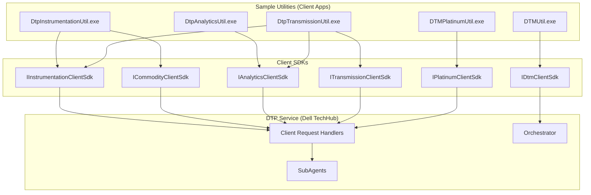
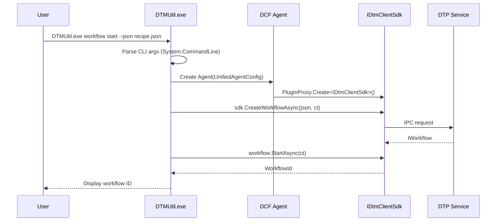
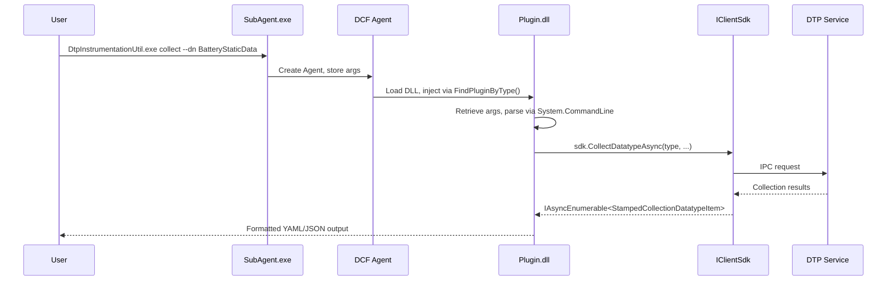

# DTM Sample Utilities -- Comprehensive How-To Guide

**Document Version**: 2026-03-22
**Source Code Path**: `ccp/sample/`
**Solution File**: `SampleUtils.sln` (9 projects)

---

## Table of Contents

- [Overview](#overview)
- [Prerequisites](#prerequisites)
- [Architecture](#architecture)
- [Common Patterns and Options](#common-patterns-and-options)
- [DTMUtil -- DTM Client SDK Utility](#dtmutil----dtm-client-sdk-utility)
- [DtpInstrumentationUtil -- Instrumentation SDK Utility](#dtpinstrumentationutil----instrumentation-sdk-utility)
- [DtpAnalyticsUtil -- Analytics SDK Utility](#dtpanalyticsutil----analytics-sdk-utility)
- [DtpTransmissionUtil -- Transmission SDK Utility](#dtptransmissionutil----transmission-sdk-utility)
- [DTMPlatinumUtil -- Platinum Client SDK Utility](#dtmplatinumutil----platinum-client-sdk-utility)
- [Workflow JSON Recipes](#workflow-json-recipes)
- [BDD Test Infrastructure](#bdd-test-infrastructure)
- [Practical Walkthroughs](#practical-walkthroughs)
- [Troubleshooting](#troubleshooting)
- [Source Code Reference](#source-code-reference)
- [Summary](#summary)

---

## Overview

### What This Guide Covers

The DTM Sample Utilities are a collection of five command-line tools that demonstrate how to use the Dell Telemetry Platform (DTP) SDKs. Each utility targets a specific SDK layer and exposes its API surface as CLI commands with options, making it straightforward to test, debug, and prototype against DTP services.

This guide documents **every command** across all five utilities, their options, the SDK methods they invoke, practical usage examples, and the supporting infrastructure (workflow JSON recipes, BDD test framework).

### Utility Summary

| Utility | SDK | Framework | Default AppId | Executable |
|---|---|---|---|---|
| **DTMUtil** | `IDtmClientSdk` | .NET 8.0 | `7153E2D7-BB0D-4771-B88D-3661AB18DE25` | `DTMUtil.exe` |
| **DtpInstrumentationUtil** | `IInstrumentationClientSdk` + `ICommodityClientSdk` | .NET 8.0 | `675f1370-b7ce-4113-8d6e-a128ee3bb74b` | `DtpInstrumentationUtil.exe` |
| **DtpAnalyticsUtil** | `IAnalyticsClientSdk` | .NET 8.0 | `675f1370-b7ce-4113-8d6e-a128ee3bb74b` | `DtpAnalyticsUtil.exe` |
| **DtpTransmissionUtil** | `ITransmissionClientSdk` + `IInstrumentationClientSdk` + `IAnalyticsClientSdk` | .NET 8.0 | `675f1370-b7ce-4113-8d6e-a128ee3bb74b` | `DtpTransmissionUtil.exe` |
| **DTMPlatinumUtil** | `IPlatinumClientSdk` | .NET Framework 4.7.2 | `37c52535-10f2-4365-b610-cdc6dcacbaa9` | `DTMPlatinumUtil.exe` |

> **Note**: DTMUtil is a standalone console application. The other four utilities use the DCF SubAgent/Plugin architecture. DTMPlatinumUtil targets .NET Framework 4.7.2 (legacy); all others target .NET 8.0.

---

## Prerequisites

### System Requirements

- **OS**: Windows 10/11 (64-bit)
- **Dell TechHub Service**: Must be installed and running
- **Permissions**: Administrator privileges required (elevated command prompt)
- **.NET 8.0 SDK/Runtime**: Required for DTMUtil, Instrumentation, Analytics, and Transmission utilities
- **.NET Framework 4.7.2**: Required for DTMPlatinumUtil only

### Building from Source

```powershell
cd ccp\sample
dotnet build SampleUtils.sln --configuration Release
```

The solution contains 9 projects:

| Project | Type | Assembly Name | Output |
|---|---|---|---|
| DTMUtil | Console App | `DTMUtil` | `DTMUtil.exe` |
| DtpInstrumentationUtil.SubAgent | SubAgent Host | `DtpInstrumentationUtil` | `DtpInstrumentationUtil.exe` |
| DtpInstrumentationUtil.Plugin | Plugin DLL | `DtpInstrumentationUtil.Plugin` | `DtpInstrumentationUtil.Plugin.dll` |
| DtpAnalyticsUtil.SubAgent | SubAgent Host | `DtpAnalyticsUtil` | `DtpAnalyticsUtil.exe` |
| DtpAnalyticsUtil.Plugin | Plugin DLL | `DtpAnalyticsUtil.Plugin` | `DtpAnalyticsUtil.Plugin.dll` |
| DtpTransmissionUtil.SubAgent | SubAgent Host | `DtpTransmissionUtil` | `DtpTransmissionUtil.exe` |
| DtpTransmissionUtil.Plugin | Plugin DLL | `DtpTransmissionUtil.Plugin` | `DtpTransmissionUtil.Plugin.dll` |
| DtpUtilHelper | Class Library | `DtpUtilHelper` | `DtpUtilHelper.dll` (shared) |
| DTMPlatinumUtil.SubAgent | Console App (.NET Fx) | `DTMPlatinumUtil` | `DTMPlatinumUtil.exe` |

### Verifying DTP is Running

```powershell
Get-Service -Name "DellTechHub"
Start-Service -Name "DellTechHub"
```

---

## Architecture

### SDK Layer Diagram



### Execution Models

**1. Standalone (DTMUtil)**

DTMUtil is a regular .NET console application. It parses CLI args via `System.CommandLine`, creates a DCF `Agent` with `UnifiedAgentConfig`, and obtains `IDtmClientSdk` via `PluginProxy.Create<IDtmClientSdk>(Agent)`.



**2. SubAgent + Plugin (Instrumentation, Analytics, Transmission, Platinum)**

These utilities use the DCF (Dell Common Framework) SubAgent pattern:

1. The SubAgent host (`.exe`) creates an `Agent` from `UnifiedAgentConfig`
2. CLI args are stored via `agent.DynamicValueSet("args", args)`
3. The Agent loads Plugin DLLs marked with `[DtpPlugin]` / `[Plugin]`
4. The Plugin constructor receives the SDK via `Agent.FindPluginByType()`
5. The Plugin retrieves CLI args and parses them with `System.CommandLine`



### Plugin Attributes

Plugins declare SDK dependencies via attributes:

```csharp
[DtpPlugin(Id, Name, Description)]
[PluginRequires(Id = PluginInformation.ClientSdk.Instrumentation.Id)]
[PluginRequires(Id = PluginInformation.ClientSdk.Commodity.Id)]
public class SamplePlugin : BaseAgentPlugin
```

---

## Common Patterns and Options

### Client Application ID (`--id`)

All utilities require a Client Application ID that identifies the calling application to DTP. Each utility has a built-in default, but a **red warning** is displayed when the default is used:

```
WARNING: Using default application ID...
```

| Utility | Default AppId | Default AppName |
|---|---|---|
| DTMUtil | `7153E2D7-BB0D-4771-B88D-3661AB18DE25` | `DTMUtil` |
| DTMUtil (`configure-orchestrator` only) | `ApplicationContracts.ApplicationGuid("SupportAssist")` | `SupportAssist` |
| Instrumentation / Analytics / Transmission | `675f1370-b7ce-4113-8d6e-a128ee3bb74b` | Utility name |
| DTMPlatinumUtil | `37c52535-10f2-4365-b610-cdc6dcacbaa9` | `DtmPlatinumUtil` |

> **Validation**: If you change `--id` from default, you must also provide `--appName` (and vice versa). Mismatched default/custom values produce an error.

### Output Format (`--json`)

Available on utilities using `DtpUtilHelper`. Default output is **YAML** format (via `YamlDotNet`). JSON output (via `Newtonsoft.Json`) can be activated by:

- Passing `--json` flag
- Setting environment variable `DTPUTIL_JSON_OUTPUT=true`

### Date/Time Formats

**Important**: Different utilities and commands use different date/time formats.

| Context | Format | Example |
|---|---|---|
| Instrumentation / Analytics / Transmission (`--from`, `--to`) | `dd/MM/yyyy HH:mm:ss zzz` | `21/01/2025 14:30:00 +08:00` |
| Analytics daily/weekly analysis (`--date`) | `dd/MM/yyyy` | `21/01/2025` |
| DTMUtil `workflow history` (`--from`, `--to`) | `yyyy/MM/dd HH:mm:ss zzz` | `2025/01/21 14:30:00 +08:00` |
| DTMUtil bundle commands (`--date`) | Standard `DateTime` | `2025-01-21` |

### Duration Format

Used by `enable-datatype`, `temporary-enable`, and other commands:

```
[<days> "."] <hours> ":" <minutes> [":" <seconds> ["." <fractional>]]
```

If a bare positive integer is provided, it is treated as seconds.

---

## DTMUtil -- DTM Client SDK Utility

DTMUtil is a standalone console application that wraps `IDtmClientSdk` for orchestrator configuration, workflow management, bundle transmission queries, and emergency data retrieval.

**Executable**: `DTMUtil.exe`
**SDK**: `IDtmClientSdk` (via `PluginProxy.Create<IDtmClientSdk>(Agent)`)
**CLI Framework**: `System.CommandLine` v2.0.0-beta1
**Source**: `ccp/sample/DTMUtil/`

### Command Tree

```
DTMUtil.exe
├── configure-orchestrator
├── apply-app-configuration
├── clear-app-configuration
├── validate-app-configuration
├── workflow
│   ├── start
│   ├── status
│   ├── retrieve
│   │   ├── collection
│   │   ├── analysis
│   │   └── alert
│   ├── cancel
│   └── history
├── configure-proxy
├── reset-proxy
├── bundle-transmission-status
├── bundle-transmission-date-range
├── retrieve-bundle-id
└── invoke-emergency
```

### Orchestrator Configuration Commands

#### `configure-orchestrator`

Configures the DTM orchestrator transmission and privacy settings. This command uses the **SupportAssist** AppId (not the default DTMUtil AppId).

```powershell
# Enable realtime transmission
DTMUtil.exe configure-orchestrator --realtime-transmission Enabled

# Set privacy mode
DTMUtil.exe configure-orchestrator --privacy-mode AnonymizeAtTransmission

# Mark transmissions as required telemetry
DTMUtil.exe configure-orchestrator --transmission-required true
```

| Option | Type | Required | Default | Description |
|---|---|---|---|---|
| `--realtime-transmission` | `TransmissionState` | No | -- | `Enabled` (2) or `Disabled` (1) |
| `--midnight-transmission` | `TransmissionState` | No | -- | `Enabled` (2) or `Disabled` (1) |
| `--privacy-mode` | `string` | No | -- | `Disabled`, `AnonymizeAtTransmission`, or `AnonymizeAtCollection` |
| `--transmission-required` | `bool?` | No | -- | Set transmissions as required telemetry |

**SDK Method**: `DtmClientSdk.ApplyFlagConfigurationAsync(json, ct)`

> **Special behavior**: When enabling realtime or midnight transmission, the command forces user consent by writing registry key `HKLM:\SOFTWARE\DELL\Notification Manager\Telemetry\ConsentOverride = 1`.

#### `apply-app-configuration`

Applies a custom application profile configuration.

```powershell
# From inline JSON
DTMUtil.exe apply-app-configuration --json '{"Profile":{"Setting":"Value"}}'

# From file
DTMUtil.exe apply-app-configuration --json-path "C:\config\profile.json"
```

| Option | Type | Required | Default | Description |
|---|---|---|---|---|
| `--json` | `string` | Mutually exclusive with `--json-path` | -- | Inline JSON payload |
| `--json-path` | `string` | Mutually exclusive with `--json` | -- | Path to JSON configuration file |

**SDK Method**: `DtmClientSdk.ApplyAppConfigurationAsync(json, ct)`

#### `clear-app-configuration`

Clears the current application configuration profile.

```powershell
DTMUtil.exe clear-app-configuration
```

**SDK Method**: `DtmClientSdk.ClearAppConfigurationAsync(ct)`

#### `validate-app-configuration`

Validates a configuration profile without applying it.

```powershell
DTMUtil.exe validate-app-configuration --json-path "C:\config\profile.json"
```

| Option | Type | Required | Default | Description |
|---|---|---|---|---|
| `--json` | `string` | Mutually exclusive with `--json-path` | -- | Inline JSON payload |
| `--json-path` | `string` | Mutually exclusive with `--json` | -- | Path to JSON configuration file |

**SDK Method**: `DtmClientSdk.ValidateAppConfigurationAsync(json, ct)`

### Workflow Management Commands

#### `workflow start`

Creates and starts a workflow from a JSON recipe file.

```powershell
# Start workflow from recipe
DTMUtil.exe workflow start --json "C:\recipes\SAOnDemand.json"

# Start and wait for completion
DTMUtil.exe workflow start --json "C:\recipes\SAOnDemand.json" --wait
```

| Option | Type | Required | Default | Description |
|---|---|---|---|---|
| `--json` | `string` | **Yes** | -- | Path to workflow JSON recipe file |
| `--wait` | `bool` | No | `false` | Block until workflow completes, fails, or is cancelled |

**SDK Methods**:
1. `DtmClientSdk.CreateWorkflowAsync(jsonString, ct)` -- reads file, creates workflow
2. `workflow.StartAsync(ct)` -- starts execution

> **Note**: The `--json` option here is a file path, not inline JSON. The file content is read via `File.ReadAllText()` and passed directly to the SDK.

#### `workflow status`

Queries the current status of a workflow.

```powershell
DTMUtil.exe workflow status --workflow-id "abc123-def456"
```

| Option | Type | Required | Default | Description |
|---|---|---|---|---|
| `--workflow-id` | `string` | **Yes** | -- | Workflow identifier (returned by `workflow start`) |
| `--datatypes` | `string[]` | No | -- | Filter by datatype names (comma-separated) |

**SDK Methods**: `DtmClientSdk.RetrieveWorkflowAsync(workflowId, ct)` then `workflow.GetStatusAsync(ct)`

#### `workflow retrieve collection`

Retrieves collection results from a completed workflow.

```powershell
# All collection results
DTMUtil.exe workflow retrieve collection --workflow-id "abc123"

# Filtered by datatypes
DTMUtil.exe workflow retrieve collection --workflow-id "abc123" --datatypes BatteryStaticData,CpuStaticInfo
```

| Option | Type | Required | Default | Description |
|---|---|---|---|---|
| `--workflow-id` | `string` | **Yes** | -- | Workflow identifier |
| `--datatypes` | `string[]` | No | -- | Comma-separated datatype names to filter |
| `--json` | `bool` | No | `false` | Output in JSON format |

**SDK Method**: `workflow.GetCollectionResultItemsAsync(ct)` or `workflow.GetCollectionResultItemsAsync(datatypeIds, ct)`

#### `workflow retrieve analysis`

Retrieves analysis results from a completed workflow. Same options as `retrieve collection`.

**SDK Method**: `workflow.GetAnalysisResultItemsAsync(ct)` or `(datatypeIds, ct)`

#### `workflow retrieve alert`

Retrieves alert results from a completed workflow. Same options as `retrieve collection`.

**SDK Method**: `workflow.GetAlertResultItemsAsync(ct)` or `(datatypeIds, ct)`

#### `workflow cancel`

Cancels a running workflow.

```powershell
DTMUtil.exe workflow cancel --workflow-id "abc123"
```

**SDK Method**: `DtmClientSdk.RetrieveWorkflowAsync(workflowId, ct)` then `workflow.CancelAsync(ct)`

#### `workflow history`

Retrieves workflow execution history within a date range.

```powershell
DTMUtil.exe workflow history --from "2025/01/01 00:00:00 +08:00" --to "2025/01/31 23:59:59 +08:00"
```

| Option | Type | Required | Default | Description |
|---|---|---|---|---|
| `--from` | `string` | **Yes** | -- | Start date (`yyyy/MM/dd HH:mm:ss zzz`) |
| `--to` | `string` | **Yes** | -- | End date (`yyyy/MM/dd HH:mm:ss zzz`) |

> **Important**: This command uses `yyyy/MM/dd HH:mm:ss zzz` format, different from other utilities.

**SDK Method**: `DtmClientSdk.GetWorkflowRequestHistoryAsync(timeRange, ct)`

**Output per result**: WorkflowId, Current Status, Creation Time, Completion Time.

### Bundle Transmission Commands

#### `bundle-transmission-status`

Queries bundle transmission status by date or bundle ID.

```powershell
# By date
DTMUtil.exe bundle-transmission-status --bundle-type Standard --date 2025-01-21

# By bundle ID
DTMUtil.exe bundle-transmission-status --bundle-type Standard --bundle-id "aabbccdd-1122-3344-5566-778899aabbcc"
```

| Option | Type | Required | Default | Description |
|---|---|---|---|---|
| `--bundle-type` | `BundleType` | **Yes** | -- | `Standard` or `ComputedAlert` |
| `--date` | `DateTime?` | No | -- | Target date |
| `--bundle-id` | `Guid?` | No | -- | Bundle identifier |

> **Validation**: At least one of `--date` or `--bundle-id` must be provided.

**SDK Method**: `DtmClientSdk.RetrieveBundleTransmissionStatusItemsAsync(bundleType, date/bundleId, ct)`

#### `bundle-transmission-date-range`

Queries bundle transmission over a date range.

```powershell
DTMUtil.exe bundle-transmission-date-range --from-date 2025-01-01 --to-date 2025-01-31
```

| Option | Type | Required | Default | Description |
|---|---|---|---|---|
| `--from-date` | `DateTime` | **Yes** | -- | Start date |
| `--to-date` | `DateTime` | **Yes** | -- | End date |

**SDK Method**: `DtmClientSdk.RetrieveBundleTransmissionStatusItemsAsync(fromDate, toDate, ct)`

#### `retrieve-bundle-id`

Retrieves bundle IDs for a date, optionally looping back multiple days.

```powershell
# Single date
DTMUtil.exe retrieve-bundle-id --date 2025-01-21

# Loopback: retrieve IDs for 5 days prior
DTMUtil.exe retrieve-bundle-id --date 2025-01-21 --loopback-days 5
```

| Option | Type | Required | Default | Description |
|---|---|---|---|---|
| `--date` | `DateTime?` | No | `DateTime.Now` | Target date |
| `--loopback-days` | `int?` | No | -- | Number of days to loop back from date |

**SDK Method**: `DtmClientSdk.RetrieveBundleIdAsync(date, ct)` (called once per day when looping)

### Emergency Invocation

#### `invoke-emergency`

Triggers an emergency data collection workflow (Fireman). Collects all emergency-configured datatypes, runs analysis, and bundles results for transmission.

```powershell
# Emergency with 5-day loopback (default)
DTMUtil.exe invoke-emergency

# Emergency with 7-day loopback
DTMUtil.exe invoke-emergency --loopback-days 7
```

| Option | Type | Required | Default | Description |
|---|---|---|---|---|
| `--loopback-days` | `int?` | No | `5` | Number of days to look back for historical data |

**SDK Method**: `DtmClientSdk.InvokeEmergencyDataRetrievalAsync(loopbackDays, ct)`

### Proxy Configuration

#### `configure-proxy`

Configures HTTP proxy settings for DTP communications.

```powershell
DTMUtil.exe configure-proxy --host "http://proxy.corp.com" --port 8080 --username "user" --password "pass"
```

| Option | Type | Required | Default | Description |
|---|---|---|---|---|
| `--host` | `string` | **Yes** | -- | Proxy host (e.g. `http://localhost`) |
| `--port` | `int` | **Yes** | -- | Proxy port (0-65535) |
| `--domain` | `string` | No | -- | Proxy domain |
| `--username` | `string` | No | -- | Proxy authentication username |
| `--password` | `string` | No | -- | Proxy authentication password (converted to SecureString) |

**SDK Method**: `DtmClientSdk.ApplyProxySettingsAsync(networkProxySettings, ct)`

#### `reset-proxy`

Resets proxy configuration to default (no proxy).

```powershell
DTMUtil.exe reset-proxy
```

**SDK Method**: `DtmClientSdk.ResetProxySettingsAsync(ct)`

---

## DtpInstrumentationUtil -- Instrumentation SDK Utility

DtpInstrumentationUtil demonstrates the `IInstrumentationClientSdk` and `ICommodityClientSdk` for data collection, subscription, retrieval, commodity operations, datatype management, and custom telemetry events.

**Executable**: `DtpInstrumentationUtil.exe`
**SDKs**: `IInstrumentationClientSdk`, `ICommodityClientSdk`
**Architecture**: SubAgent + Plugin (`DtpInstrumentationUtil.Plugin`)
**Source**: `ccp/sample/DtpInstrumentationUtil.SubAgent/` + `ccp/sample/DtpInstrumentationUtil.Plugin/`

> **Note**: This utility has both a standalone mode (`Program.cs`, ~550 lines of CLI parsing) and a plugin mode (`SamplePlugin.cs`, ~1147 lines of SDK execution). CLI args are parsed in `Program.cs`, stored in a `CommandLineParameters` object, and consumed by the Plugin for actual SDK calls.

### Data Collection Commands

#### `collect`

Performs on-demand data collection for a specific datatype or all datatypes.

```powershell
# Single datatype
DtpInstrumentationUtil.exe collect --id "{675f1370-b7ce-4113-8d6e-a128ee3bb74b}" --datatype-name BatteryStaticData --json

# With item ID and max cache age
DtpInstrumentationUtil.exe collect --id "{675f1370-b7ce-4113-8d6e-a128ee3bb74b}" --datatype-name BatteryDynamicData --item-id "Battery_0" --max-age 60

# All datatypes
DtpInstrumentationUtil.exe collect --id "{675f1370-b7ce-4113-8d6e-a128ee3bb74b}" --all

# Multiple iterations
DtpInstrumentationUtil.exe collect --id "{675f1370-b7ce-4113-8d6e-a128ee3bb74b}" --datatype-name BatteryDynamicData --iterations 5
```

| Option | Type | Required | Default | Description |
|---|---|---|---|---|
| `--id` | `string` | No | `675f1370-...` | Client Application ID |
| `--datatype-name` | `string` | Yes* | -- | Datatype to collect |
| `--item-id` | `string` | No | `""` (= `ItemId.All`) | Specific item within the datatype |
| `--max-age` | `int` | No | `0` | Maximum cache age in seconds; 0 = force fresh |
| `--all` | `bool` | No | `false` | Collect all available datatypes |
| `--iterations` | `int` | No | `1` | Number of collection iterations |
| `--json` | `bool` | No | `false` | Output in JSON format |

\* Required unless `--all` is specified.

**SDK Method**: `_instSdk.CollectDatatypeAsync(type, itemId, maxAge, ct)` per iteration. When `--all`, iterates all exported types implementing `IMetadataProvider<ICollectionDatatypeMetadata>`.

#### `periodic-collect`

Starts periodic data collection at a specified interval for a given duration.

```powershell
DtpInstrumentationUtil.exe periodic-collect --id "{675f1370-b7ce-4113-8d6e-a128ee3bb74b}" --datatype-name CpuUsage --interval 30 --duration 3600
```

| Option | Type | Required | Default | Description |
|---|---|---|---|---|
| `--datatype-name` | `string` | **Yes** | -- | Datatype to collect |
| `--item-id` | `string` | No | `""` | Specific item |
| `--interval` | `string` | No | Datatype's `DefaultCollectionInterval` | Collection interval in seconds |
| `--duration` | `string` | No | `3600` (1 hour) | Total duration in seconds |

**SDK Method**: `_instSdk.StartPeriodicCollectionRequestAsync<T>(itemId, interval, duration, ct)` (invoked via reflection for generic type resolution)

> **Note**: If a `DuplicateRequestException` occurs, the plugin cancels existing requests and retries.

#### `subscribe`

Subscribes to real-time data updates. Interactive: press **Enter** to trigger a collection, press **Esc** to exit.

```powershell
DtpInstrumentationUtil.exe subscribe --id "{675f1370-b7ce-4113-8d6e-a128ee3bb74b}" --datatype-name BatteryDynamicData --json
```

| Option | Type | Required | Default | Description |
|---|---|---|---|---|
| `--datatype-name` | `string` | **Yes** | -- | Datatype to subscribe to |
| `--item-id` | `string` | No | `""` | Specific item ID filter |
| `--json` | `bool` | No | `false` | Output in JSON format |

**SDK Methods**:
- `_instSdk.SubscribeAsync(type, itemId, callback, ct)` -- sets up subscription
- On Enter: `_instSdk.CollectDatatypeAsync(type, itemId, TimeSpan.Zero, ct)` -- forces fresh collection
- On Esc: `subscription.CancelAsync()` -- exits

### Data Retrieval Commands

#### `retrieve`

Retrieves historical data for a datatype within a time range (all clients' data).

```powershell
DtpInstrumentationUtil.exe retrieve --id "{675f1370-b7ce-4113-8d6e-a128ee3bb74b}" --datatype-name BatteryStaticData \
  --from "20/01/2025 00:00:00 +08:00" --to "21/01/2025 23:59:59 +08:00"
```

| Option | Type | Required | Default | Description |
|---|---|---|---|---|
| `--datatype-name` | `string` | **Yes** | -- | Datatype to retrieve |
| `--item-id` | `string` | No | `""` | Specific item |
| `--from` | `string` | No | `DateTimeOffset.MinValue` | Start timestamp (`dd/MM/yyyy HH:mm:ss zzz`) |
| `--to` | `string` | No | `DateTimeOffset.MaxValue` | End timestamp |

**SDK Method**: `_instSdk.RetrieveDataAsync(type, itemId, from, to, ct)`

#### `client-retrieve`

Retrieves data previously collected by **this client application only**.

```powershell
DtpInstrumentationUtil.exe client-retrieve --id "{675f1370-b7ce-4113-8d6e-a128ee3bb74b}" --datatype-name BatteryStaticData \
  --from "20/01/2025 00:00:00 +08:00" --to "21/01/2025 23:59:59 +08:00" --json
```

Same options as `retrieve`.

**SDK Method**: `_instSdk.RetrieveClientDataAsync(type, itemId, from, to, ct)`

#### `retrieve-file`

Retrieves a file associated with a collection result.

```powershell
# Print to console
DtpInstrumentationUtil.exe retrieve-file --id "{675f1370-b7ce-4113-8d6e-a128ee3bb74b}" --fileId "aabbccdd-1122-3344-5566-778899aabbcc"

# Copy to folder
DtpInstrumentationUtil.exe retrieve-file --id "{675f1370-b7ce-4113-8d6e-a128ee3bb74b}" --fileId <guid> --folder "C:\Output"
```

| Option | Type | Required | Default | Description |
|---|---|---|---|---|
| `--fileId` | `string` | **Yes** | -- | File identifier from collection result |
| `--folder` | `string` | No | `""` | Output directory (if empty, prints content to console) |

**SDK Method**: `_instSdk.RetrieveFileAsync(fileId, ct)` -- returns `(sourcePath, originalFilename)`

#### `retrieve-requests`

Lists or cancels pending periodic collection requests.

```powershell
# List all pending requests
DtpInstrumentationUtil.exe retrieve-requests --id "{675f1370-b7ce-4113-8d6e-a128ee3bb74b}"

# List for specific datatype
DtpInstrumentationUtil.exe retrieve-requests --id "{675f1370-b7ce-4113-8d6e-a128ee3bb74b}" --datatype-name CpuUsage

# Cancel all requests
DtpInstrumentationUtil.exe retrieve-requests --id "{675f1370-b7ce-4113-8d6e-a128ee3bb74b}" --cancel
```

| Option | Type | Required | Default | Description |
|---|---|---|---|---|
| `--datatype-name` | `string` | No | -- | Filter by datatype (if omitted, queries all) |
| `--item-id` | `string` | No | `""` | Specific item |
| `--cancel` | `bool` | No | `false` | Cancel discovered requests |

**SDK Method**: `_instSdk.RetrievePeriodicCollectionRequestAsync<T>(itemId, ct)` (iterates all datatype types if name omitted)

### Commodity Operations

Commodities are DTP's interface for reading/writing system properties and subscribing to change events.

#### `get-commodity`

Gets current values of one or more commodity properties.

```powershell
DtpInstrumentationUtil.exe get-commodity --id "{675f1370-b7ce-4113-8d6e-a128ee3bb74b}" --commodity IBattery --item-id "Battery_0" --property BatteryHealth --property ChargeStatus
```

| Option | Type | Required | Default | Description |
|---|---|---|---|---|
| `--commodity` | `string` | **Yes** | `""` | Commodity interface name (e.g. `IBattery`, `IAudioCommodity`) |
| `--item-id` | `string[]` | No | `[""]` | Item IDs (multiple allowed) |
| `--property` | `string[]` | **Yes** | -- | Property names to read (one or more) |

**SDK Method**: `_commSdk.GetCommodityAsync<T>(itemId, ct)` then reflection to read property values.

#### `set-commodity`

Sets a commodity property value and optionally listens for change events.

```powershell
DtpInstrumentationUtil.exe set-commodity --id "{675f1370-b7ce-4113-8d6e-a128ee3bb74b}" --commodity IDisplay --item-id "Display_0" --property Brightness --value "75" --valueChangedNames BrightnessChanged
```

| Option | Type | Required | Default | Description |
|---|---|---|---|---|
| `--commodity` | `string` | **Yes** | -- | Commodity interface name |
| `--item-id` | `string[]` | No | `[""]` | Item IDs |
| `--property` | `string[]` | **Yes** | -- | Property name to set |
| `--value` | `string` | **Yes** | -- | New value (auto-converted to property type) |
| `--valueChangedNames` | `string[]` | No | `[]` | Event names to subscribe to after setting |

**SDK Method**: `_commSdk.GetCommodityAsync<T>(itemId, ct)` then reflection to call setter. Value conversion handles enums, TimeSpan, Nullable, JSON arrays, and primitives.

#### `subscribe-commodity`

Subscribes to commodity value change events.

```powershell
DtpInstrumentationUtil.exe subscribe-commodity --id "{675f1370-b7ce-4113-8d6e-a128ee3bb74b}" --commodity IBattery --item-id "Battery_0" --valueChangedNames BatteryHealthChanged ChargeStatusChanged
```

| Option | Type | Required | Default | Description |
|---|---|---|---|---|
| `--commodity` | `string` | **Yes** | -- | Commodity interface name |
| `--item-id` | `string[]` | No | `[""]` | Item IDs |
| `--valueChangedNames` | `string[]` | **Yes** | -- | Event names to subscribe to |

**SDK Method**: Uses reflection to subscribe to named events on the commodity object. Interactive: press Esc to exit.

### Datatype Management Commands

#### `metadata`

Retrieves metadata about all available instrumentation datatypes, organized by commodity type.

```powershell
DtpInstrumentationUtil.exe metadata --id "{675f1370-b7ce-4113-8d6e-a128ee3bb74b}"
```

**SDK Method**: `_instSdk.GetMetadataByCommodityAsync(commodity, ct)` for each `CommodityType` enum value.

**Output per datatype**: DatatypeId, Version, Description, CommodityType, PluginId, Plugin Version, Collection Trigger, Volatility, DefaultCollectionInterval, ShortestCollectionInterval.

#### `enable-datatype`

Temporarily enables a disabled event-based datatype.

```powershell
DtpInstrumentationUtil.exe enable-datatype --id "{675f1370-b7ce-4113-8d6e-a128ee3bb74b}" --datatype-name BsodEvent --duration "01:00:00"
```

| Option | Type | Required | Default | Description |
|---|---|---|---|---|
| `--datatype-name` | `string` | **Yes** | -- | Datatype to enable (must be event-based) |
| `--duration` | `string` | No | `"00:05:00"` (5 min) | Duration as TimeSpan |

**SDK Method**: `_instSdk.EnableEventBasedDatatypeAsync(datatypeId, duration, ct)` -- returns `DatatypeStateChangeRequestId`

#### `reset-datatype-state`

Resets the state of a previously enabled event-based datatype.

```powershell
DtpInstrumentationUtil.exe reset-datatype-state --id "{675f1370-b7ce-4113-8d6e-a128ee3bb74b}" --request-id "aabbccdd-1122-3344-5566-778899aabbcc"
```

| Option | Type | Required | Default | Description |
|---|---|---|---|---|
| `--request-id` | `string` | **Yes** | -- | Request ID from `enable-datatype` response |

**SDK Method**: `_instSdk.ResetRequestedEventBasedDatatypeState(requestId, ct)`

### Custom Software Telemetry Events

#### `emit-custom-software-telemetry-event`

Emits a custom software telemetry event to DTP. Supports parallel and repeated execution for load testing.

```powershell
# Simple event
DtpInstrumentationUtil.exe emit-custom-software-telemetry-event --event-type "AppCrash"

# Full event with metadata and file
DtpInstrumentationUtil.exe emit-custom-software-telemetry-event \
  --event-type "PerformanceDegradation" \
  --event-severity Warning \
  --component-name "Renderer" \
  --event-metadata "component=Renderer" --event-metadata "fps=12" \
  --associated-file-path "C:\Logs\perf.log" \
  --associated-file-upload-required true

# Event with structured data payload
DtpInstrumentationUtil.exe emit-custom-software-telemetry-event \
  --event-type "DiagnosticResult" \
  --event-data '{"score":85,"details":{"cpu":"ok","memory":"warning"}}'

# Load test: 100 calls, 10 parallel, 50ms delay between batches
DtpInstrumentationUtil.exe emit-custom-software-telemetry-event \
  --event-type "LoadTest" \
  --number-of-calls 100 --parallel-calls true --number-of-parallel-calls 10 --call-delay-ms 50
```

| Option | Type | Required | Default | Description |
|---|---|---|---|---|
| `--event-type` | `string` | **Yes** | -- | Event type identifier |
| `--event-id` | `string?` | No | `null` | Unique event identifier |
| `--event-timestamp` | `string?` | No | `DateTimeOffset.Now` | Event timestamp |
| `--event-severity` | `string?` | No | `null` | `Info`, `Warning`, or `Error` |
| `--component-name` | `string?` | No | `null` | Component generating the event |
| `--event-metadata` | `string[]` | No | `[]` | Key=value pairs (repeatable) |
| `--event-data` | `string?` | No | `null` | Structured JSON payload (deserialized to `ExpandoObject`) |
| `--associated-file-path` | `string?` | No | `null` | Path to associated file |
| `--associated-file-upload-required` | `bool?` | No | `false` | Whether the file should be uploaded |
| `--number-of-calls` | `int?` | No | `1` | Number of times to emit |
| `--call-delay-ms` | `int?` | No | `0` | Delay between calls/batches (ms) |
| `--parallel-calls` | `bool?` | No | `false` | Execute calls in parallel |
| `--number-of-parallel-calls` | `int?` | No | `1` | Batch size for parallel execution |

**SDK Methods**:
- Without `--event-data`: `_instSdk.EmitCustomSoftwareTelemetryEventAsync(event, [associatedFile], ct)`
- With `--event-data`: `_instSdk.EmitCustomSoftwareTelemetryEventAsync(event<ExpandoObject>, [associatedFile], ct)`

### Unregister

#### `unregister`

Unregisters the client application from DTP instrumentation services.

```powershell
DtpInstrumentationUtil.exe unregister --id "{675f1370-b7ce-4113-8d6e-a128ee3bb74b}"
```

**SDK Method**: `_instSdk.UnregisterAsync(ct)`

---

## DtpAnalyticsUtil -- Analytics SDK Utility

DtpAnalyticsUtil demonstrates the `IAnalyticsClientSdk` for triggering analysis operations (custom/daily/weekly), managing alerts and subscriptions, retrieving analysis/alert results, and temporary datatype enabling.

**Executable**: `DtpAnalyticsUtil.exe`
**SDK**: `IAnalyticsClientSdk`
**Architecture**: SubAgent + Plugin (`DtpAnalyticsUtil.Plugin`)
**Source**: `ccp/sample/DtpAnalyticsUtil.SubAgent/` + `ccp/sample/DtpAnalyticsUtil.Plugin/`

### Analysis Commands

#### `custom-analysis`

Triggers a custom (on-demand) analysis for a datatype over a time range.

```powershell
DtpAnalyticsUtil.exe custom-analysis --id "{675f1370-b7ce-4113-8d6e-a128ee3bb74b}" --datatype-name BatteryAnalysis --json

# With time range
DtpAnalyticsUtil.exe custom-analysis --id "{675f1370-b7ce-4113-8d6e-a128ee3bb74b}" --datatype-name BatteryAnalysis \
  --from "20/01/2025 00:00:00 +08:00" --to "21/01/2025 23:59:59 +08:00"
```

| Option | Type | Required | Default | Description |
|---|---|---|---|---|
| `--datatype-name` | `string` | **Yes** | -- | Datatype to analyze |
| `--item-id` | `string` | No | `""` (= `ItemId.All`) | Specific item |
| `--from` | `string` | No | Now - 30 days | Start timestamp (`dd/MM/yyyy HH:mm:ss zzz`) |
| `--to` | `string` | No | Now | End timestamp |
| `--json` | `bool` | No | `false` | Output in JSON format |

**SDK Method**: `_sdk.RunCustomAnalysisAsync(type, itemId, from, to, ct)`

#### `daily-analysis`

Triggers a daily analysis for a specific date.

```powershell
DtpAnalyticsUtil.exe daily-analysis --id "{675f1370-b7ce-4113-8d6e-a128ee3bb74b}" --datatype-name BatteryAnalysis --date "21/01/2025"
```

| Option | Type | Required | Default | Description |
|---|---|---|---|---|
| `--datatype-name` | `string` | **Yes** | -- | Datatype to analyze |
| `--item-id` | `string` | No | `""` | Specific item |
| `--date` | `string` | No | Today | Target date (`dd/MM/yyyy`, converted to `DateOnly`) |

**SDK Method**: `_sdk.RunDailyAnalysisAsync(type, itemId, dateOnly, ct)`

#### `weekly-analysis`

Triggers a weekly analysis starting from a given date.

```powershell
DtpAnalyticsUtil.exe weekly-analysis --id "{675f1370-b7ce-4113-8d6e-a128ee3bb74b}" --datatype-name BatteryAnalysis --date "20/01/2025"
```

Same options as `daily-analysis`.

**SDK Method**: `_sdk.RunWeeklyAnalysisAsync(type, itemId, firstDayOfWeek, ct)`

### Alert Commands

#### `default-alert`

Runs a one-shot default alert evaluation or subscribes for continuous monitoring.

```powershell
# One-shot evaluation
DtpAnalyticsUtil.exe default-alert --id "{675f1370-b7ce-4113-8d6e-a128ee3bb74b}" --datatype-name BatteryQuickDischargeAlert --json

# Subscribe for continuous alerts (Esc to exit)
DtpAnalyticsUtil.exe default-alert --id "{675f1370-b7ce-4113-8d6e-a128ee3bb74b}" --datatype-name BatteryQuickDischargeAlert --subscribe true
```

| Option | Type | Required | Default | Description |
|---|---|---|---|---|
| `--datatype-name` | `string` | **Yes** | -- | Datatype |
| `--item-id` | `string` | No | `""` | Specific item |
| `--from` | `string` | No | Now - 30 days | Start timestamp |
| `--to` | `string` | No | Now | End timestamp |
| `--subscribe` | `bool` | No | `false` | Subscribe mode (interactive, Esc to exit) |

**SDK Methods**:
- One-shot: `_sdk.RunDefaultAlertAsync(type, ItemId.All, from, to, ct)`
- Subscribe: `_sdk.SubscribeForDefaultAlertsAsync(type, itemId, callback, ct)` -- blocks until Esc

#### `custom-alert`

Runs a custom alert with specified parameters or subscribes for continuous monitoring.

```powershell
# One-shot with parameters
DtpAnalyticsUtil.exe custom-alert --id "{675f1370-b7ce-4113-8d6e-a128ee3bb74b}" --datatype-name BatteryQuickDischargeAlert \
  --parameters Threshold=50 Sensitivity=High

# Subscribe with parameters
DtpAnalyticsUtil.exe custom-alert --id "{675f1370-b7ce-4113-8d6e-a128ee3bb74b}" --datatype-name BatteryQuickDischargeAlert \
  --subscribe true --parameters Threshold=50
```

| Option | Type | Required | Default | Description |
|---|---|---|---|---|
| `--datatype-name` | `string` | **Yes** | -- | Datatype |
| `--item-id` | `string` | No | `""` | Specific item |
| `--from` | `string` | No | Now - 30 days | Start timestamp |
| `--to` | `string` | No | Now | End timestamp |
| `--subscribe` | `bool` | No | `false` | Subscribe mode |
| `--parameters` | `Dictionary<string,string>` | No | `{}` | Alert parameters as `Key=Value` pairs; list values as `Key=V1,V2,V3` |

**SDK Methods**:
- One-shot: `_sdk.RunCustomAlertAsync(type, ItemId.All, from, to, alertParameters, ct)`
- Subscribe: `_sdk.SubscribeForCustomAlertsAsync(type, itemId, callback, alertParameters, ct)`

> **Parameter reflection**: Alert parameters are applied to the datatype's `AlertParametersType` via `Activator.CreateInstance` and property reflection. Comma-separated values for `IEnumerable` properties.

#### `register-alert`

Registers persistent custom (or default) alert parameters with a time-limited duration.

```powershell
# Register custom alert
DtpAnalyticsUtil.exe register-alert --id "{675f1370-b7ce-4113-8d6e-a128ee3bb74b}" --datatype-name BatteryQuickDischargeAlert \
  --parameters Threshold=50 --duration "24:00:00"

# Register with default parameters
DtpAnalyticsUtil.exe register-alert --id "{675f1370-b7ce-4113-8d6e-a128ee3bb74b}" --datatype-name BatteryQuickDischargeAlert --default-alert true

# Cancel registered alerts
DtpAnalyticsUtil.exe register-alert --id "{675f1370-b7ce-4113-8d6e-a128ee3bb74b}" --datatype-name BatteryQuickDischargeAlert --cancel
```

| Option | Type | Required | Default | Description |
|---|---|---|---|---|
| `--datatype-name` | `string` | **Yes** | -- | Datatype |
| `--item-id` | `string` | No | `""` | Specific item |
| `--duration` | `string` | No | `"24:00:00"` | Duration the registration lasts |
| `--default-alert` | `bool` | No | `false` | Use default alert parameters |
| `--parameters` | `Dictionary<string,string>` | No | `{}` | Custom alert parameters |
| `--cancel` | `bool` | No | `false` | Cancel existing registrations |

**SDK Methods**:
- Register: `_sdk.RegisterCustomAlertParametersAsync(type, itemId, alertParams, duration, ct)`
- Cancel: `_sdk.RetrieveCustomAlertRequestAsync(type, itemId, ct)` then `request.CancelAsync()` per request

### Subscription Commands

#### `subscribe`

Subscribes to new analysis runs for a datatype. Interactive: press **Enter** to trigger a daily analysis, **Esc** to exit.

```powershell
DtpAnalyticsUtil.exe subscribe --id "{675f1370-b7ce-4113-8d6e-a128ee3bb74b}" --datatype-name BatteryAnalysis --json
```

**SDK Methods**:
- `_sdk.SubscribeForAnalysisAsync(type, itemId, callback, ct)`
- On Enter: `_sdk.RunDailyAnalysisAsync(type, itemId, today, ct)` to trigger

#### `create-alert-subscriptions`

Creates batch alert subscriptions for one or multiple datatypes.

```powershell
DtpAnalyticsUtil.exe create-alert-subscriptions --id "{675f1370-b7ce-4113-8d6e-a128ee3bb74b}" --datatype-names BatteryQuickDischargeAlert,CpuHighActivityAlert \
  --duration "240:00:00"
```

| Option | Type | Required | Default | Description |
|---|---|---|---|---|
| `--datatype-names` | `List<string>` | **Yes** | -- | Comma-separated datatype names |
| `--parameters` | `Dictionary<string,string>` | No | `{}` | Alert parameters |
| `--duration` | `string` | No | 10 days | Subscription duration |

**SDK Method**: `_sdk.SubscribeForAlertsAsync(alertSubscriptions, ct)`

#### `retrieve-alert-subscriptions`

Retrieves and optionally cancels existing alert subscriptions.

```powershell
# List subscriptions
DtpAnalyticsUtil.exe retrieve-alert-subscriptions --id "{675f1370-b7ce-4113-8d6e-a128ee3bb74b}"

# Cancel subscriptions
DtpAnalyticsUtil.exe retrieve-alert-subscriptions --id "{675f1370-b7ce-4113-8d6e-a128ee3bb74b}" --cancel
```

| Option | Type | Required | Default | Description |
|---|---|---|---|---|
| `--cancel` | `bool` | No | `false` | Cancel all discovered subscriptions |

**SDK Methods**:
- List: `_sdk.GetAlertSubscriptionsAsync(ct)`
- Cancel: `_sdk.UnsubscribeForAlertsAsync(subscriptions, ct)`

#### `listen-alert-subscriptions`

Listens for alert events on all existing subscriptions. Hooks the `AlertReceived` event and runs alert evaluations.

```powershell
DtpAnalyticsUtil.exe listen-alert-subscriptions --id "{675f1370-b7ce-4113-8d6e-a128ee3bb74b}"
```

| Option | Type | Required | Default | Description |
|---|---|---|---|---|
| `--from` | `string` | No | Now - 30 days | Start timestamp |
| `--to` | `string` | No | Now | End timestamp |

**SDK Methods**:
- Hooks `_sdk.AlertReceived` event handler
- `_sdk.GetAlertSubscriptionsAsync(ct)` to discover subscriptions
- For each: `_sdk.RunDefaultAlertAsync(...)` or `_sdk.RunCustomAlertAsync(...)` depending on parameters
- Blocks on `Console.ReadLine()` -- press Enter to exit

### Data Retrieval Commands

#### `retrieve-analysis`

Retrieves historical analysis results. Supports daily, weekly, and custom analysis types.

```powershell
# Custom/weekly analysis retrieval
DtpAnalyticsUtil.exe retrieve-analysis --id "{675f1370-b7ce-4113-8d6e-a128ee3bb74b}" --datatype-name BatteryAnalysis \
  --from "20/01/2025 00:00:00 +08:00" --to "21/01/2025 23:59:59 +08:00" --type Custom

# Daily analysis retrieval (only --from is used as the date)
DtpAnalyticsUtil.exe retrieve-analysis --id "{675f1370-b7ce-4113-8d6e-a128ee3bb74b}" --datatype-name BatteryAnalysis \
  --from "21/01/2025 00:00:00 +08:00" --type Daily
```

| Option | Type | Required | Default | Description |
|---|---|---|---|---|
| `--datatype-name` | `string` | **Yes** | -- | Datatype |
| `--item-id` | `string` | No | `""` | Specific item |
| `--from` | `string` | No | varies | Start timestamp (for Daily, used as the date) |
| `--to` | `string` | No | Now | End timestamp (not used for Daily) |
| `--type` | `string` | No | `"Daily"` | `Daily`, `Weekly`, or `Custom` |

**SDK Methods**:
- Daily: `_sdk.RetrieveDailyAnalysisDataAsync(type, itemId, dateTimeOffset, ct)`
- Non-Daily: `_sdk.RetrieveAnalysisDataAsync(type, itemId, from, to, ct)`

#### `retrieve-alert`

Retrieves alert results for a specific datatype.

```powershell
DtpAnalyticsUtil.exe retrieve-alert --id "{675f1370-b7ce-4113-8d6e-a128ee3bb74b}" --datatype-name BatteryQuickDischargeAlert \
  --item-id "Battery_0" --from "20/01/2025 00:00:00 +08:00" --to "21/01/2025 23:59:59 +08:00"
```

**SDK Method**: `_sdk.RetrieveAlertDataAsync(type, itemId, from, to, ct)`

#### `retrieve-alerts`

Retrieves alerts across multiple datatypes.

```powershell
DtpAnalyticsUtil.exe retrieve-alerts --id "{675f1370-b7ce-4113-8d6e-a128ee3bb74b}" --datatype-names BatteryQuickDischargeAlert CpuHighActivityAlert \
  --from "20/01/2025 00:00:00 +08:00" --to "21/01/2025 23:59:59 +08:00"
```

| Option | Type | Required | Default | Description |
|---|---|---|---|---|
| `--datatype-names` | `string[]` | **Yes** | -- | Multiple datatype names (space-separated) |
| `--from` | `string` | No | Now - 30 days | Start timestamp |
| `--to` | `string` | No | Now | End timestamp |

**SDK Method**: `_sdk.RetrieveAlertDataAsync(ISet<DatatypeItemSelector>, TimeRange, ct)`

#### `retrieve-client-alerts`

Retrieves alerts triggered by this client application across multiple datatypes.

```powershell
DtpAnalyticsUtil.exe retrieve-client-alerts --id "{675f1370-b7ce-4113-8d6e-a128ee3bb74b}" --datatype-names BatteryQuickDischargeAlert \
  --from "20/01/2025 00:00:00 +08:00" --to "21/01/2025 23:59:59 +08:00"
```

Same options as `retrieve-alerts`.

**SDK Method**: `_sdk.RetrieveClientAlertDataAsync(ISet<DatatypeItemSelector>, TimeRange, ct)`

#### `retrieve-custom`

Retrieves custom alert registrations for a datatype, with optional cancellation.

```powershell
DtpAnalyticsUtil.exe retrieve-custom --id "{675f1370-b7ce-4113-8d6e-a128ee3bb74b}" --datatype-name BatteryQuickDischargeAlert

# Cancel retrieved requests
DtpAnalyticsUtil.exe retrieve-custom --id "{675f1370-b7ce-4113-8d6e-a128ee3bb74b}" --datatype-name BatteryQuickDischargeAlert --cancel
```

| Option | Type | Required | Default | Description |
|---|---|---|---|---|
| `--datatype-name` | `string` | **Yes** | -- | Datatype |
| `--item-id` | `string` | No | `""` | Specific item |
| `--cancel` | `bool` | No | `false` | Cancel retrieved requests |

**SDK Method**: `_sdk.RetrieveCustomAlertRequestAsync(type, itemId, ct)` then optionally `request.CancelAsync()`

### Metadata

#### `metadata`

Retrieves metadata about all available analytics datatypes, filterable by type and commodity.

```powershell
# All metadata
DtpAnalyticsUtil.exe metadata --id "{675f1370-b7ce-4113-8d6e-a128ee3bb74b}"

# Analysis metadata only
DtpAnalyticsUtil.exe metadata --id "{675f1370-b7ce-4113-8d6e-a128ee3bb74b}" --type Analysis

# Alert metadata for specific commodity
DtpAnalyticsUtil.exe metadata --id "{675f1370-b7ce-4113-8d6e-a128ee3bb74b}" --type Alert --commodity Battery
```

| Option | Type | Required | Default | Description |
|---|---|---|---|---|
| `--type` | `string` | No | `All` | `Analysis`, `Alert`, or `All` |
| `--commodity` | `string` | No | -- | Filter by commodity type |

**SDK Methods**:
- Analysis: `_sdk.GetAllAnalysisMetadataAsync(ct)` or `_sdk.GetAnalysisMetadataByCommodityAsync(commodity, ct)`
- Alert: `_sdk.GetAllAlertMetadataAsync(ct)` or `_sdk.GetAlertMetadataByCommodityAsync(commodity, ct)`

### Temporary Enabling

#### `temporary-enable`

Temporarily enables a RealTime alert datatype for monitoring.

```powershell
DtpAnalyticsUtil.exe temporary-enable --id "{675f1370-b7ce-4113-8d6e-a128ee3bb74b}" --datatype-name BatteryPermanentFailureAlert --duration "01:00:00"
```

| Option | Type | Required | Default | Description |
|---|---|---|---|---|
| `--datatype-name` | `string` | **Yes** | -- | Must be a RealTime alert datatype |
| `--duration` | `string` | **Yes** | -- | Duration (TimeSpan or seconds) |

> **Validation**: Verifies datatype has `AlertType.RealTime` via `DatatypeMetadataVault`; throws `ArgumentException` otherwise.

**SDK Method**: `_sdk.MonitorRealtimeAlertAsync(type, duration, ct)` -- returns a request ID

#### `retrieve-temporary-enabling-requests`

Retrieves and optionally cancels temporary enabling requests.

```powershell
# List requests
DtpAnalyticsUtil.exe retrieve-temporary-enabling-requests --id "{675f1370-b7ce-4113-8d6e-a128ee3bb74b}" --datatype-name BatteryPermanentFailureAlert

# Cancel requests
DtpAnalyticsUtil.exe retrieve-temporary-enabling-requests --id "{675f1370-b7ce-4113-8d6e-a128ee3bb74b}" --datatype-name BatteryPermanentFailureAlert --cancel
```

| Option | Type | Required | Default | Description |
|---|---|---|---|---|
| `--datatype-name` | `string` | **Yes** | -- | Must be a RealTime alert datatype |
| `--cancel` | `bool` | No | `false` | Cancel discovered requests |

**SDK Methods**:
- List: `_sdk.RetrieveRealtimeAlertMonitoringRequestsAsync(type, ct)`
- Cancel: `_sdk.CancelRealtimeAlertMonitoringRequestAsync(requestId, ct)` per request

### Unregister

#### `unregister`

```powershell
DtpAnalyticsUtil.exe unregister --id "{675f1370-b7ce-4113-8d6e-a128ee3bb74b}"
```

**SDK Method**: `_sdk.UnregisterAsync(ct)`

---

## DtpTransmissionUtil -- Transmission SDK Utility

DtpTransmissionUtil demonstrates the `ITransmissionClientSdk` for collecting and transmitting data to the cloud, retrieving historical data for transmission, periodic transmission, file uploads, and transmission lifecycle management. It also uses the Instrumentation and Analytics SDKs for data collection.

**Executable**: `DtpTransmissionUtil.exe`
**SDKs**: `ITransmissionClientSdk`, `IInstrumentationClientSdk`, `IAnalyticsClientSdk`
**Architecture**: SubAgent + Plugin (`DtpTransmissionUtil.Plugin`)
**Source**: `ccp/sample/DtpTransmissionUtil.SubAgent/` + `ccp/sample/DtpTransmissionUtil.Plugin/`

### Base Options (All Commands)

All DtpTransmissionUtil commands inherit these options from the plugin's `BaseCommand`:

| Option | Type | Default | Description |
|---|---|---|---|
| `--id` | `string` | `675f1370-...` | Client Application ID |
| `--appName` | `string` | `DtpTransmissionUtil` | Client application name |
| `--options` | `TransmissionOptions?` | `null` | `None` or `Required` |

The `BaseCommand` automatically constructs a `TransmissionConfiguration` (with PE Authenticode cert hash, priority, schema, classification) and validates `--id`/`--appName` consistency.

### Collect and Transmit

#### `collect-transmit`

Collects data and immediately transmits to the cloud. Supports single datatype or batch (`--all`).

```powershell
# Single datatype
DtpTransmissionUtil.exe collect-transmit --id "{675f1370-b7ce-4113-8d6e-a128ee3bb74b}" --datatype-name BatteryStaticData

# All datatypes (batch collection + analysis + alerts + transmit)
DtpTransmissionUtil.exe collect-transmit --id "{675f1370-b7ce-4113-8d6e-a128ee3bb74b}" --all

# Wait for transmission completion
DtpTransmissionUtil.exe collect-transmit --id "{675f1370-b7ce-4113-8d6e-a128ee3bb74b}" --datatype-name BatteryStaticData --wait

# With app metadata
DtpTransmissionUtil.exe collect-transmit --id "{675f1370-b7ce-4113-8d6e-a128ee3bb74b}" --datatype-name BatteryStaticData --app-metadata source=manual --app-metadata reason=diagnostic
```

| Option | Type | Required | Default | Description |
|---|---|---|---|---|
| `--datatype-name` | `string` | Yes* | -- | Datatype to collect and transmit |
| `--item-id` | `string` | No | `""` | Specific item |
| `--all` | `bool` | No | `false` | Batch: collect all instrumentation, run all analysis + alerts, transmit |
| `--wait` | `bool` | No | `false` | Wait for transmission completion |
| `--app-metadata` | `Dictionary<string,string>` | No | -- | Key=value metadata pairs |

\* Required unless `--all` is specified. Both cannot be provided simultaneously.

**SDK Methods**:
- Single: `_instrumentationClientSdk.CollectDatatypeAsync(type, itemId, TimeSpan.Zero, ct)` then `_transmissionClientSdk.TransmitDataAsync(type, data, config, appMetadata, ct)`
- Batch (`--all`): Uses `DtpBatchAccessHelper` to `CollectAllInstrumentationDatatypesAsync`, `RunAllAnalysisDatatypesAsync`, `RunAllAlertDatatypesAsync`, then `TransmitAsync`
- If `--wait`: `_transmissionClientSdk.SubscribeToTransmissionUpdatesAsync(transmissionId, ct)`

### Retrieve and Transmit

#### `retrieve-transmit`

Retrieves historical data and transmits to the cloud.

```powershell
DtpTransmissionUtil.exe retrieve-transmit --id "{675f1370-b7ce-4113-8d6e-a128ee3bb74b}" --datatype-name BatteryStaticData \
  --transmissionId "tx-12345" \
  --from "20/01/2025 00:00:00 +08:00" --to "21/01/2025 23:59:59 +08:00"
```

| Option | Type | Required | Default | Description |
|---|---|---|---|---|
| `--datatype-name` | `string` | No | -- | Datatype |
| `--item-id` | `string` | No | `""` | Specific item |
| `--all` | `bool` | No | `false` | Retrieve all datatypes |
| `--transmissionId` | `string` | **Yes** | -- | Transmission identifier |
| `--from` | `string` | No | `DateTimeOffset.MinValue` | Start time (`dd/MM/yyyy HH:mm:ss zzz`) |
| `--to` | `string` | No | `DateTimeOffset.MaxValue` | End time |
| `--wait` | `bool` | No | `false` | Wait for transmission |
| `--app-metadata` | `Dictionary<string,string>` | No | -- | Key=value metadata |

**SDK Methods**: `_instrumentationClientSdk.RetrieveDataAsync(...)` then `_transmissionClientSdk.TransmitDataAsync(...)`

### Periodic Transmit

#### `periodic-transmit`

Starts periodic collection and transmission at a specified interval.

```powershell
DtpTransmissionUtil.exe periodic-transmit --id "{675f1370-b7ce-4113-8d6e-a128ee3bb74b}" --datatype-name CpuUsage --interval 60 --duration 1800
```

| Option | Type | Required | Default | Description |
|---|---|---|---|---|
| `--datatype-name` | `string` | **Yes** | -- | Datatype |
| `--item-id` | `string` | No | `""` | Specific item |
| `--interval` | `string` | No | Datatype's `DefaultCollectionInterval` | Interval in seconds |
| `--duration` | `string` | No | 1 hour | Duration in seconds |
| `--app-metadata` | `Dictionary<string,string>` | No | -- | Key=value metadata |

**SDK Methods**: `_instrumentationClientSdk.StartPeriodicCollectionRequestAsync<T>(...)` + `_instrumentationClientSdk.SubscribeAsync(type, itemId, TransmitCallback, ct)`. Each callback triggers `_transmissionClientSdk.TransmitDataAsync(...)`.

Interactive: press **Esc** to stop.

### File Upload

#### `file-upload`

Uploads a file to the cloud.

```powershell
DtpTransmissionUtil.exe file-upload --id "{675f1370-b7ce-4113-8d6e-a128ee3bb74b}" --path "C:\Logs\diagnostic.zip"

# With custom configuration
DtpTransmissionUtil.exe file-upload --id "{675f1370-b7ce-4113-8d6e-a128ee3bb74b}" --path "C:\Logs\diagnostic.zip" \
  --class Restricted --priority High --schemaId 21003 --wait
```

| Option | Type | Required | Default | Description |
|---|---|---|---|---|
| `--path` | `string` | **Yes** | -- | File path to upload |
| `--class` | `DataClassificationId` | No | `Restricted` | Data classification |
| `--metadata` | `Dictionary<string,string>` | No | -- | App metadata key=value pairs |
| `--requestId` | `string` | No | -- | Custom tracking token |
| `--priority` | `Priority` | No | `Normal` | `High`, `Normal`, or `Low` |
| `--schemaId` | `int` | No | `21003` | Schema ID |
| `--schemaVersion` | `int` | No | `1` | Schema version |
| `--wait` | `bool` | No | `false` | Wait for upload completion |

**SDK Method**: `_transmissionClientSdk.UploadFileAsync(path, configuration, appMetadata, [requestId], ct)`

### Transmission Lifecycle

#### `transmission-status`

Queries the status of a specific transmission.

```powershell
DtpTransmissionUtil.exe transmission-status --id "{675f1370-b7ce-4113-8d6e-a128ee3bb74b}" --transmissionId "tx-12345"

# Wait and track status changes
DtpTransmissionUtil.exe transmission-status --id "{675f1370-b7ce-4113-8d6e-a128ee3bb74b}" --transmissionId "tx-12345" --wait
```

| Option | Type | Required | Default | Description |
|---|---|---|---|---|
| `--transmissionId` | `string` | **Yes** | -- | Transmission identifier |
| `--wait` | `bool` | No | `false` | Subscribe to status updates until terminal state |

**SDK Method**: `_transmissionClientSdk.QueryCurrentTransmissionStatusAsync(transmissionId, ct)`

#### `cancel`

Cancels a pending or in-progress transmission. Uses `ITransmissionClientSdkInternal`.

```powershell
DtpTransmissionUtil.exe cancel --id "{675f1370-b7ce-4113-8d6e-a128ee3bb74b}" --transmission-id "tx-12345"
```

| Option | Type | Required | Default | Description |
|---|---|---|---|---|
| `--transmission-id` | `TransmissionId` | **Yes** | -- | Transmission to cancel |

**SDK Method**: `_transmissionClientSdkInternal.CancelTransmissionAsync(transmissionId, ct)`

### Unregister

#### `unregister`

```powershell
DtpTransmissionUtil.exe unregister --id "{675f1370-b7ce-4113-8d6e-a128ee3bb74b}"
```

**SDK Method**: `_transmissionClientSdk.UnregisterAsync(ct)`

---

## DTMPlatinumUtil -- Platinum Client SDK Utility

DTMPlatinumUtil demonstrates the `IPlatinumClientSdk`, which is the legacy Platinum transmitter SDK. It supports event logging, file upload, heartbeat, one-time ping, transmission status queries, and proxy configuration.

**Executable**: `DTMPlatinumUtil.exe`
**SDK**: `IPlatinumClientSdk`
**Framework**: .NET Framework 4.7.2 (legacy)
**Source**: `ccp/sample/DTMPlatinumUtil.SubAgent/`

> **Important**: The Platinum SDK is a legacy interface (tracked under DTP-7691 for deprecation). New integrations should use `ITransmissionClientSdk` instead.

> **Note**: DTMPlatinumUtil has its own `BaseCommand.cs` and `CommonValues.cs` -- it does NOT share `DtpUtilHelper`.

### Event Logging

#### `platinum-event`

Transmits a tagged event to the cloud. Supports tag-only, simple value, or complex (key=value) payloads.

```powershell
# Tag-only event
DTMPlatinumUtil.exe platinum-event --id "{675f1370-b7ce-4113-8d6e-a128ee3bb74b}" --tag "SystemCheck"

# Simple value event
DTMPlatinumUtil.exe platinum-event --id "{675f1370-b7ce-4113-8d6e-a128ee3bb74b}" --tag "Temperature" --value "85.5"

# Complex event with key-value pairs
DTMPlatinumUtil.exe platinum-event --id "{675f1370-b7ce-4113-8d6e-a128ee3bb74b}" --tag "DiagResult" --complex score=85 status=pass

# Wait for transmission and enforce unified consent
DTMPlatinumUtil.exe platinum-event --id "{675f1370-b7ce-4113-8d6e-a128ee3bb74b}" --tag "Test" --value "ok" --wait --unified-consent true
```

| Option | Type | Required | Default | Description |
|---|---|---|---|---|
| `--id` | `string` | No | `37c52535-...` | Client Application ID |
| `--appName` | `string` | No | `DtmPlatinumUtil` | Client application name |
| `--tag` | `string` | **Yes** | -- | Event tag |
| `--class` | `DataClassificationId` | No | `Restricted` | Data classification |
| `--value` | `string` | No | -- | Simple value (mutually exclusive with `--complex`) |
| `--complex` | `Dictionary<string,string>` | No | -- | Complex value as `key=value` pairs (mutually exclusive with `--value`) |
| `--wait` | `bool` | No | `false` | Wait for transmission completion |
| `--unified-consent` | `bool` | No | `false` | Enforce unified consent |
| `--options` | `TransmissionOptions?` | No | -- | `None` or `Required` |

**SDK Methods**:
- Tag-only: `_platinumClientSdk.LogEventAsync(tag, classification, ct)`
- Simple: `_platinumClientSdk.LogEventAsync(tag, value, classification, ct)`
- Complex: `_platinumClientSdk.LogEventAsync(tag, complexValue, classification, ct)`

### File Upload

#### `platinum-upload`

Uploads a text log file via the Platinum transmitter.

```powershell
DTMPlatinumUtil.exe platinum-upload --id "{675f1370-b7ce-4113-8d6e-a128ee3bb74b}" --path "C:\Logs\app.log"

# With metadata
DTMPlatinumUtil.exe platinum-upload --id "{675f1370-b7ce-4113-8d6e-a128ee3bb74b}" --path "C:\Logs\app.log" --metadata source=manual --metadata reason=support
```

| Option | Type | Required | Default | Description |
|---|---|---|---|---|
| `--path` | `string` | **Yes** | -- | File to upload |
| `--class` | `DataClassificationId` | No | `Restricted` | Data classification |
| `--metadata` | `Dictionary<string,string>` | No | -- | Custom metadata key=value pairs |
| `--wait` | `bool` | No | `false` | Wait for upload completion |
| `--unified-consent` | `bool` | No | `false` | Enforce unified consent |
| `--options` | `TransmissionOptions?` | No | -- | Transmission option |

**SDK Method**: `_platinumClientSdk.UploadTextLogFileAsync(path, metadata, classification, ct)`

### Heartbeat and Ping

#### `platinum-heartbeat`

Sends a heartbeat signal to the Platinum transmitter.

```powershell
DTMPlatinumUtil.exe platinum-heartbeat --id "{675f1370-b7ce-4113-8d6e-a128ee3bb74b}"

# Wait for completion
DTMPlatinumUtil.exe platinum-heartbeat --id "{675f1370-b7ce-4113-8d6e-a128ee3bb74b}" --wait
```

| Option | Type | Required | Default | Description |
|---|---|---|---|---|
| `--class` | `DataClassificationId` | No | `Restricted` | Data classification |
| `--wait` | `bool` | No | `false` | Wait for transmission |
| `--unified-consent` | `bool` | No | `false` | Enforce unified consent |
| `--options` | `TransmissionOptions?` | No | -- | Transmission option |

**SDK Method**: `_platinumClientSdk.HeartbeatAsync(classification, ct)`

#### `platinum-ping`

Sends a one-time ping to verify Platinum transmitter connectivity.

```powershell
DTMPlatinumUtil.exe platinum-ping --id "{675f1370-b7ce-4113-8d6e-a128ee3bb74b}" --wait
```

Same options as `platinum-heartbeat`.

**SDK Method**: `_platinumClientSdk.OneTimePingAsync(classification, ct)`

### Transmission Status

#### `transmission-status`

Queries the status of a Platinum transmission.

```powershell
DTMPlatinumUtil.exe transmission-status --id "{675f1370-b7ce-4113-8d6e-a128ee3bb74b}" --transmissionId "tx-12345" --wait
```

| Option | Type | Required | Default | Description |
|---|---|---|---|---|
| `--transmissionId` | `string` | **Yes** | -- | Transmission identifier |
| `--wait` | `bool` | No | `false` | Subscribe to status updates until terminal state |

**SDK Method**: `_platinumClientSdk.GetTransmissionStatusAsync(transmissionId, ct)`

### Proxy Configuration

#### `configure-proxy`

Configures HTTP proxy for Platinum transmitter communications.

```powershell
DTMPlatinumUtil.exe configure-proxy --host "http://proxy.corp.com" --port 8080 --username "user" --password "pass"
```

| Option | Type | Required | Default | Description |
|---|---|---|---|---|
| `--host` | `string` | **Yes** | -- | Proxy host (e.g. `http://localhost`) |
| `--port` | `int` | **Yes** | -- | Proxy port (0-65535) |
| `--domain` | `string` | No | -- | Proxy domain |
| `--username` | `string` | No | -- | Proxy authentication username |
| `--password` | `string` | No | -- | Proxy authentication password (converted to SecureString) |

**SDK Method**: `_platinumClientSdk.ApplyProxySettingsAsync(networkProxySettings, ct)`

#### `reset-proxy`

Resets proxy configuration to default (direct connection).

```powershell
DTMPlatinumUtil.exe reset-proxy
```

**SDK Method**: `_platinumClientSdk.ResetProxySettingsAsync(ct)`

---

## Workflow JSON Recipes

DTMUtil's `workflow start --json <path>` reads a JSON recipe file and passes it to `DtmClientSdk.CreateWorkflowAsync()`. The JSON defines which datatypes to collect, analyze, compute alerts for, and how to transmit the results.

### JSON Structure

```json
{
  "Workflow": {
    "Telemetry": {
      "Header": {
        "SchemaVersion": "1.1.0",
        "ClientWorkflowId": "{GUID}",
        "Version": "1.0.0",
        "Name": "Workflow Name"
      },
      "Instrumentation": {
        "WorkflowDuration": "0.00:03:00",
        "Datatypes": {
          "DatatypeName": { "Collect": { "OnDemandSnapshot": ["OnStart"] } }
        }
      },
      "Analytics": {
        "WorkflowDuration": "0.00:03:00",
        "Datatypes": {
          "AnalysisDatatypeName": { "Analyze": { "OnDemandAnalysis": "MidnightToNow" } },
          "AlertDatatypeName": { "Compute": { "OnDemandComputation": "MidnightToNow" } },
          "RetrieveAlertName": { "Retrieve": { "LookbackRelative": "Midnight" } }
        }
      },
      "Transmission": {
        "Schedules": {
          "ScheduleName": {
            "ScheduleTime": "OnWorkflowDatasetReady",
            "SchemaId": 1013,
            "Priority": "Realtime",
            "TransmissionOption": "Required",
            "CollectionDatatypes": { "Name": {} },
            "AnalysisDatatypes": { "Name": {} },
            "AlertDatatypes": { "Name": {} }
          }
        }
      }
    }
  }
}
```

### SAOnDemand.json (Reference Recipe)

A Support Assist on-demand workflow recipe exists in the test resources. It defines:

- **83 instrumentation datatypes** to collect (battery, CPU, display, disk, GPU, memory, network, OS, sensor, thermal, system, etc.)
- **25 analysis datatypes** (Analyze operation: `OnDemandAnalysis: MidnightToNow`)
- **36 computed alert datatypes** (Compute operation: `OnDemandComputation: MidnightToNow`)
- **9 retrieve alert datatypes** (Retrieve operation: `LookbackRelative: Midnight`)
- **2 transmission schedules** (one for collections+analyses, one for computed+realtime alerts)

**Usage**:

```powershell
DTMUtil.exe workflow start --json "C:\recipes\SAOnDemand.json" --wait
```

### Common Datatype Categories

| Category | Example Instrumentation Datatypes | Example Analysis/Alert Datatypes |
|---|---|---|
| Battery | `BatteryStaticData`, `BatteryAnalyticsData`, `ChargerStaticInfo`, `ChargerDynamicInfo` | `BatteryAnalysis`, `BatterySessionAnalysis`, `BatteryLargeDropCapacityAlert` |
| CPU | `CpuStaticInfo`, `CpuPowerData` | `CpuAnalysis`, `CpuHighActivityAlert`, `CpuHighTemperatureAlert` |
| Disk/Storage | `PhysicalDiskStaticInfo`, `LogicalDrive`, `SmartStaticInfo`, `NvmeIdentifyControllerData` | `PhysicalDiskAnalysis`, `SmartAnalysis`, `StorageReliabilityAlert` |
| GPU | `AmdGraphicStaticInfo`, `NvidiaGraphicStaticInfo`, `VideoAdapterInfo` | `AmdGraphicsAnalysis`, `NvidiaGraphicsAnalysis`, `IntegratedGpuAnalysis` |
| Memory | `MemoryStaticInfo`, `DimmInfo` | `MemoryAnalysis`, `MemoryDimmChangeAlert`, `MemorySizeChangeAlert` |
| Network | `NetworkStaticInfo`, `LANData`, `WLANData`, `WWANData` | `NetworkAnalysis`, `WiFiConnectAnalysis`, `WirelessSecurityAnalysis` |
| Thermal/Fan | `ThermalStaticInfo`, `FanData`, `FanStaticData` | `ThermalAnalysis`, `FanAnalysis`, `ThermalTripAlert` |
| System | `SystemInformation`, `SystemboardInfo`, `BiosInfo`, `OperatingSystemInfo` | `OperatingSystemUptimeAnalysis`, `BiosVersionChangeAlert` |

---

## BDD Test Infrastructure

The repository includes a BDD (Behavior-Driven Development) test framework that validates DTMUtil behavior. These are **not** part of `SampleUtils.sln` but exist as separate projects.

### Projects

| Project | Purpose | Framework |
|---|---|---|
| `DTM.Bdd.Server` | Mock REST API server on port 5000 | ASP.NET Core |
| `DTM.BddTests` | BDD test scenarios | NUnit + Reqnroll + Allure |

### BDD Feature Scenarios

#### BundleId.feature (`@bundleId`)

Tests bundle ID retrieval and transmission status:

1. **Verify bundle ID generation with different date formats**: Generates bundle IDs for today in `yyyy-MM-dd` and `MM-dd-yyyy` formats, verifies they match.

2. **Verify bundle transmission status for different bundle types** (Scenario Outline): Queries transmission status for a date with `BundleType = Standard` (SchemaId `1013`). Verifies non-null status with exactly one record.

3. **Verify bundle transmission status for specific date range** (Scenario Outline): Queries last 2 days, verifies bundle IDs are generated correctly and one record per date exists.

#### Fireman.feature (`@fireman`)

Tests emergency invocation workflows:

**Scenario Outline: Validate Fireman SDK for loopback days**

| Step | Detail |
|---|---|
| Given | DTM Client SDK is initialized; all subagents are running |
| When | Fireman command invoked for `<loopbackDays>` days loopback |
| Then | Results include `<fullDays>` full days and 1 partial day |
| And | Each date has a correctly generated BundleId |
| And | Partial day response contains timestamp in ISO format |
| And | Partial day transmission is successful |
| And | SchemaId for partial day is `1013` |
| And | Non-transmission statuses have `NonTransmissionReasonKind` specified |

Example: `loopbackDays=5`, `fullDays=5`

### Running BDD Tests

```powershell
cd DTM.BddTests
dotnet test --logger "trx" --results-directory TestResults
```

---

## Practical Walkthroughs

### Walkthrough 1: Collecting and Inspecting Battery Data

```powershell
# Step 1: List available datatypes
DtpInstrumentationUtil.exe metadata --id "675f1370-b7ce-4113-8d6e-a128ee3bb74b"

# Step 2: Collect battery static data
DtpInstrumentationUtil.exe collect --id "675f1370-b7ce-4113-8d6e-a128ee3bb74b" \
  --datatype-name BatteryStaticData --json

# Step 3: Collect with specific item
DtpInstrumentationUtil.exe collect --id "675f1370-b7ce-4113-8d6e-a128ee3bb74b" \
  --datatype-name BatteryDynamicData --item-id "Battery_0" --json

# Step 4: Retrieve last 24 hours
DtpInstrumentationUtil.exe retrieve --id "675f1370-b7ce-4113-8d6e-a128ee3bb74b" \
  --datatype-name BatteryStaticData \
  --from "20/01/2025 00:00:00 +08:00" --to "21/01/2025 00:00:00 +08:00" --json
```

### Walkthrough 2: Running an Emergency Workflow

```powershell
# Step 1: Invoke emergency with 7-day loopback
DTMUtil.exe invoke-emergency --loopback-days 7
# Note the workflow ID in the output

# Step 2: Check bundle transmission status
DTMUtil.exe bundle-transmission-status --bundle-type Standard --date 2025-01-21
```

### Walkthrough 3: Running a Workflow from JSON Recipe

```powershell
# Step 1: Start workflow and wait for completion
DTMUtil.exe workflow start --json "C:\recipes\SAOnDemand.json" --wait
# Blocks until complete; note workflow ID

# Step 2: Retrieve collection results
DTMUtil.exe workflow retrieve collection --workflow-id "<id>" --json

# Step 3: Retrieve analysis results
DTMUtil.exe workflow retrieve analysis --workflow-id "<id>" --json

# Step 4: Retrieve alert results
DTMUtil.exe workflow retrieve alert --workflow-id "<id>" --json

# Step 5: View workflow history
DTMUtil.exe workflow history --from "2025/01/20 00:00:00 +08:00" --to "2025/01/22 00:00:00 +08:00"
```

### Walkthrough 4: Monitoring Real-Time Telemetry

```powershell
# Subscribe to battery dynamic data (interactive)
DtpInstrumentationUtil.exe subscribe --id "675f1370-b7ce-4113-8d6e-a128ee3bb74b" \
  --datatype-name BatteryDynamicData --json
# Press Enter to trigger collection, Esc to exit
```

### Walkthrough 5: Collecting, Analyzing, and Transmitting

```powershell
# Step 1: Collect data
DtpInstrumentationUtil.exe collect --id "{675f1370-b7ce-4113-8d6e-a128ee3bb74b}" --datatype-name BatteryStaticData

# Step 2: Run daily analysis
DtpAnalyticsUtil.exe daily-analysis --id "{675f1370-b7ce-4113-8d6e-a128ee3bb74b}" --datatype-name BatteryStaticData --json

# Step 3: Check for alerts
DtpAnalyticsUtil.exe default-alert --id "{675f1370-b7ce-4113-8d6e-a128ee3bb74b}" --datatype-name BatteryStaticData --json

# Step 4: Transmit to cloud
DtpTransmissionUtil.exe collect-transmit --id "{675f1370-b7ce-4113-8d6e-a128ee3bb74b}" --datatype-name BatteryStaticData --wait

# Step 5: Check transmission status
DtpTransmissionUtil.exe transmission-status --id "{675f1370-b7ce-4113-8d6e-a128ee3bb74b}" --transmissionId "<id-from-step-4>"
```

### Walkthrough 6: Uploading a Diagnostic File

```powershell
# Via Transmission SDK
DtpTransmissionUtil.exe file-upload --id "{675f1370-b7ce-4113-8d6e-a128ee3bb74b}" --path "C:\Logs\diagnostic.zip" --priority High --wait

# Via Platinum SDK (legacy)
DTMPlatinumUtil.exe platinum-upload --id "{675f1370-b7ce-4113-8d6e-a128ee3bb74b}" --path "C:\Logs\diagnostic.zip" --wait
```

### Walkthrough 7: Emitting Custom Telemetry Events

```powershell
# Simple event
DtpInstrumentationUtil.exe emit-custom-software-telemetry-event --event-type "AppStart"

# Structured event with file upload
DtpInstrumentationUtil.exe emit-custom-software-telemetry-event \
  --event-type "CrashReport" \
  --event-severity Error \
  --component-name "CoreEngine" \
  --event-data '{"errorCode":42,"stackTrace":"..."}' \
  --associated-file-path "C:\Logs\crash.dmp" \
  --associated-file-upload-required true
```

---

## Troubleshooting

### Dell TechHub Service Not Running

**Symptom**: SDK initialization fails, connection timeouts, or "service not available" errors.

```powershell
Get-Service -Name "DellTechHub"
Start-Service -Name "DellTechHub"   # Requires admin
```

### Permission Denied / Access Denied

**Symptom**: Operations fail with permission or access errors.

**Resolution**: Run from an elevated (Administrator) command prompt. All utilities except commodity-only operations require elevation (`AllowUnelevatedExecution = false`).

### Default AppId Warning

**Symptom**: Output begins with red `WARNING: Using default application ID...`

**Resolution**: Supply an explicit `--id` parameter. If you provide `--id`, you must also provide `--appName`.

### AppId/AppName Mismatch Error

**Symptom**: `"Id and AppName mismatch. Please provide the --id value for the requested --appName."`

**Resolution**: Both `--id` and `--appName` must be either both default or both custom. You cannot change one without the other.

### Datatype Not Found

**Symptom**: `ArgumentException: No datatype was found with name <name>`

**Resolution**:
1. Verify exact datatype name spelling (case-sensitive match via `string.Equals`)
2. Use the `metadata` command to list available datatypes
3. Ensure required DTP plugins are installed

### Invalid Date Format

**Symptom**: Parsing errors on `--from`/`--to`/`--date` options.

**Resolution**: Match the correct format:

```powershell
# Instrumentation/Analytics/Transmission: dd/MM/yyyy HH:mm:ss zzz
--from "21/01/2025 00:00:00 +08:00"

# Analytics daily/weekly: dd/MM/yyyy
--date "21/01/2025"

# DTMUtil workflow history: yyyy/MM/dd HH:mm:ss zzz
--from "2025/01/21 00:00:00 +08:00"

# DTMUtil bundle commands: standard DateTime
--date 2025-01-21
```

### Platinum SDK Deprecation

**Symptom**: DTMPlatinumUtil features may not work on newer DTP versions.

**Resolution**: The Platinum SDK is legacy (DTP-7691). Migrate to `ITransmissionClientSdk` (`DtpTransmissionUtil`) for new integrations.

### Log Files

DTP log files for debugging are located at:

```
C:\ProgramData\Dell\TechHub\Logs\
```

---

## Source Code Reference

### Project File Index

| Project | Key Source Files | Primary Responsibility |
|---|---|---|
| DTMUtil | `Program.cs` (~231 lines), `Commands/*.cs` | CLI setup, SDK wiring, command handlers |
| DTMUtil | `BaseDtmUtilCommand.cs`, `CommonValues.cs` | Shared base, default AppId, cert hashes |
| DtpInstrumentationUtil.SubAgent | `Program.cs` (~550 lines) | CLI parsing, `CommandLineParameters` |
| DtpInstrumentationUtil.Plugin | `SamplePlugin.cs` (~1147 lines) | All SDK execution logic |
| DtpAnalyticsUtil.SubAgent | `Program.cs` (~66 lines) | SubAgent host entry point |
| DtpAnalyticsUtil.Plugin | `SamplePlugin.cs` (~1177 lines) | All 19 analytics commands |
| DtpTransmissionUtil.SubAgent | `Program.cs` (~75 lines) | SubAgent host entry point |
| DtpTransmissionUtil.Plugin | `SamplePlugin.cs`, `Commands/*.cs` (~7 files) | 7 transmission commands (1 file per command) |
| DtpTransmissionUtil.Plugin | `BaseCommand.cs` (~176 lines) | Plugin-specific base with cert handling |
| DtpTransmissionUtil.Plugin | `DtpBatchAccessHelper.cs` (~152 lines) | Batch collect/analyze/transmit for `--all` |
| DtpUtilHelper | `BaseCommand.cs` (~204 lines) | Shared base class with `--id`, `--appName`, `--from`, `--to` |
| DtpUtilHelper | `DtpUtilHelper.cs` (~183 lines) | Output formatting (YAML/JSON), `FindDatatypeType()`, shared options |
| DTMPlatinumUtil.SubAgent | `Program.cs`, `MainPlugin.cs`, `Commands/*.cs` | Platinum commands, own BaseCommand |

### Key Shared Classes

| Class | Location | Purpose |
|---|---|---|
| `BaseCommand` (DtpUtilHelper) | `DtpUtilHelper/BaseCommand.cs` | Shared `--id`, `--appName`, `--from`, `--to`; `IDisposable`; AppId/AppName validation |
| `DtpUtilHelper` | `DtpUtilHelper/DtpUtilHelper.cs` | `SampleAppId` constant, `FindDatatypeType()`, YAML/JSON formatting, shared options |
| `BaseDtmUtilCommand` | `DTMUtil/BaseDtmUtilCommand.cs` | DTMUtil-specific base; `WorkflowStatusChanged` event hooking |
| `BaseCommand` (Transmission Plugin) | `DtpTransmissionUtil.Plugin/BaseCommand.cs` | Transmission-specific base with `--options`, cert extraction, `TransmissionConfiguration` |
| `BaseCommand` (Platinum) | `DTMPlatinumUtil.SubAgent/BaseCommand.cs` | Platinum-specific base; reflection-based option discovery |

### NuGet Dependencies

| Package | Version | Used By |
|---|---|---|
| `System.CommandLine` | 2.0.0-beta1.21308.1 | All utilities (CLI parsing) |
| `System.Linq.Async` | 6.0.1 | Instrumentation, Analytics, Transmission plugins |
| `YamlDotNet` | 15.1.4 | DtpUtilHelper (YAML output) |
| `Dell.TechHub.Sdk.ClientCoreExtensions` | `$(TechHubSdkVersion)` | SubAgent hosts |
| `Dell.DTM.Platinum.Sdk` | `$(SamplesUseSdkVersion)` | DTMPlatinumUtil |

---

## Summary

### Key Points

1. **Five CLI utilities** cover the full DTP SDK surface: DTMUtil (orchestration), Instrumentation (collection + commodity), Analytics (analysis + alerts), Transmission (cloud upload), and Platinum (legacy transmitter)
2. **Two execution models**: DTMUtil runs standalone; the other four use the DCF SubAgent + Plugin pattern with SDK injection via `Agent.FindPluginByType()`
3. **Three different default AppIds** exist across utilities -- always specify `--id` and `--appName` together
4. **Date format varies by command**: `dd/MM/yyyy HH:mm:ss zzz` for most, `dd/MM/yyyy` for daily/weekly analysis, `yyyy/MM/dd HH:mm:ss zzz` for DTMUtil history, standard DateTime for bundle queries
5. **DTMPlatinumUtil is legacy** (.NET Framework 4.7.2, DTP-7691) -- prefer `DtpTransmissionUtil` for new work
6. **Workflow JSON recipes** define complex multi-datatype collection/analysis/transmission pipelines
7. **All utilities require** Dell TechHub running + Administrator privileges + Windows
8. **Interactive commands** (`subscribe`, `subscribe-commodity`, `periodic-collect`, `listen-alert-subscriptions`) block until user presses Esc or Enter

### Quick Reference: Command Count by Utility

| Utility | Command Count | SDK |
|---|---|---|
| DTMUtil | 17 | `IDtmClientSdk` |
| DtpInstrumentationUtil | 15 | `IInstrumentationClientSdk` + `ICommodityClientSdk` |
| DtpAnalyticsUtil | 19 | `IAnalyticsClientSdk` |
| DtpTransmissionUtil | 7 | `ITransmissionClientSdk` + `IInstrumentationClientSdk` + `IAnalyticsClientSdk` |
| DTMPlatinumUtil | 7 | `IPlatinumClientSdk` |
| **Total** | **65** | |

### Checklist

- [ ] Dell TechHub service is installed and running
- [ ] Running from elevated (Administrator) command prompt
- [ ] .NET 8.0 SDK installed (for building from source)
- [ ] .NET Framework 4.7.2 installed (only if using DTMPlatinumUtil)
- [ ] Using explicit `--id` and `--appName` (avoid default AppId warning)
- [ ] Using correct date/time format for the target utility and command
- [ ] Workflow JSON recipe file is accessible and valid (for `workflow start`)
- [ ] DTP consent is configured (for data collection/transmission operations)
- [ ] Correct datatype name spelling verified (case-sensitive matching)
