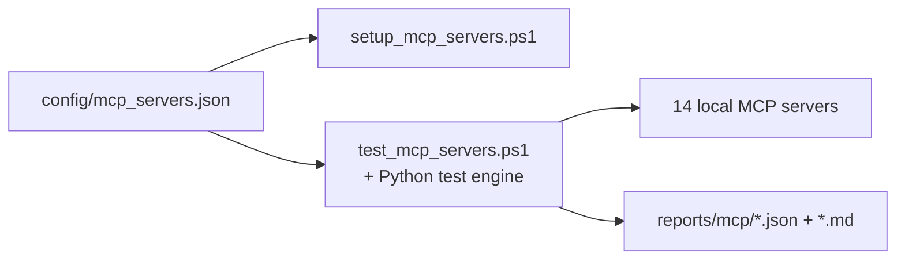

# MCP Batch Test and Documentation Audit Implementation Plan

> **For agentic workers:** REQUIRED SUB-SKILL: Use superpowers:subagent-driven-development (recommended) or superpowers:executing-plans to implement this plan task-by-task. Steps use checkbox (`- [ ]`) syntax for tracking.

**Goal:** Add a safe one-command integration test for all 14 local MCP servers, generate JSON and Markdown pass/fail reports, and reconcile repository Markdown with the current architecture and test workflow.

**Architecture:** A shared JSON manifest supplies installation and testing metadata. A Python standard-library engine implements streamable-HTTP MCP requests, failure isolation, and reporting; a PowerShell wrapper provides the Windows entry point. Tests use a local fake MCP HTTP server, and documentation changes are based on a recorded audit rather than mechanical edits.

**Tech Stack:** PowerShell 5.1+, Python 3 standard library, MCP JSON-RPC over streamable HTTP, `unittest`/`pytest`, JSON, Markdown.

## Global Constraints

- Test only `127.0.0.1:8777-8790`; do not test remote DTM/PK proxies or model providers.
- Invoke only `initialize`, `notifications/initialized`, `tools/list`, and the manifest-designated read-only health tool.
- Never create confirmation tokens, write notes, transmit telemetry, change DTP configuration, or save baselines.
- Continue after individual server failures and return exit code `1` if any server fails.
- Generate both JSON and Markdown reports even when one or more servers fail.
- The Python test engine must use only the standard library.
- Preserve current setup/uninstall behavior and PowerShell 5.1 compatibility.
- Review all existing Markdown; change only files with stale claims, broken references, or missing current workflow links.

---

### Task 1: Shared MCP Server Manifest

**Files:**
- Create: `config/mcp_servers.json`
- Create: `tests/test_mcp_manifest.py`
- Modify: `setup_mcp_servers.ps1:72-102`

**Interfaces:**
- Produces: JSON array entries with `name`, `directory`, `port`, `task`, `run_level`, `description`, and `health_tool`.
- Consumed by: `setup_mcp_servers.ps1` and `scripts/test_mcp_servers.py`.

- [ ] **Step 1: Write the failing manifest consistency tests**

Create `tests/test_mcp_manifest.py` with tests that load `config/mcp_servers.json`, assert exactly 14 unique names and ports covering `8777..8790`, assert valid required fields/run levels, locate one `*_mcp_server.py` in every declared directory, parse each entry point for its `FastMCP(... port=N)` declaration, and assert every configured health tool appears as a function in that entry point.

```python
import json
import re
from pathlib import Path

ROOT = Path(__file__).resolve().parents[1]
MANIFEST = ROOT / "config" / "mcp_servers.json"
REQUIRED = {"name", "directory", "port", "task", "run_level", "description", "health_tool"}


def load_entries():
    return json.loads(MANIFEST.read_text(encoding="utf-8"))


def test_manifest_has_all_local_servers():
    entries = load_entries()
    assert len(entries) == 14
    assert len({e["name"] for e in entries}) == 14
    assert {e["port"] for e in entries} == set(range(8777, 8791))


def test_manifest_entries_match_server_sources():
    for entry in load_entries():
        assert REQUIRED <= entry.keys()
        assert entry["run_level"] in {"Highest", "Limited"}
        directory = ROOT / "mcp" / entry["directory"]
        servers = list(directory.glob("*_mcp_server.py"))
        assert len(servers) == 1, entry["name"]
        source = servers[0].read_text(encoding="utf-8")
        assert re.search(rf"FastMCP\([^\n]+port={entry['port']}\)", source)
        assert re.search(rf"^def {re.escape(entry['health_tool'])}\(", source, re.MULTILINE)
```

- [ ] **Step 2: Run the test and verify RED**

Run: `python -m pytest tests/test_mcp_manifest.py -v`

Expected: FAIL because `config/mcp_servers.json` does not exist.

- [ ] **Step 3: Create the manifest from the current `$MCPS` registry**

Create all 14 entries in port order. Preserve the current descriptions and task names from `setup_mcp_servers.ps1`; set `run_level` to `Limited` only for Obsidian and `Highest` for all others. Health tools are:

```text
srum_health, eventlog_health, crash_health, exec_health, drift_health,
netconn_health, perfmon_health, disk_status, procinspect_health,
memstate_health, filterstack_health, winupdate_health, dtm_health,
obsidian_health
```

- [ ] **Step 4: Run the manifest test and verify GREEN**

Run: `python -m pytest tests/test_mcp_manifest.py -v`

Expected: 2 tests pass.

- [ ] **Step 5: Add a failing test for installer manifest use**

Append a test that reads `setup_mcp_servers.ps1` and asserts it references `config\mcp_servers.json`, calls `ConvertFrom-Json`, and no longer contains the inline `$MCPS = @(` declaration.

```python
def test_setup_script_loads_shared_manifest():
    source = (ROOT / "setup_mcp_servers.ps1").read_text(encoding="utf-8-sig")
    assert "config\\mcp_servers.json" in source
    assert "ConvertFrom-Json" in source
    assert "$MCPS = @(" not in source
```

- [ ] **Step 6: Run the installer-source test and verify RED**

Run: `python -m pytest tests/test_mcp_manifest.py::test_setup_script_loads_shared_manifest -v`

Expected: FAIL because the setup script still declares `$MCPS` inline.

- [ ] **Step 7: Replace the inline registry with validated manifest loading**

In `setup_mcp_servers.ps1`, load `$here\config\mcp_servers.json`, validate the array count, required properties, unique names/ports, and run levels, and map JSON names to the existing property names expected later in the script:

```powershell
$manifestPath = Join-Path $here "config\mcp_servers.json"
if (-not (Test-Path -LiteralPath $manifestPath)) { Die "MCP manifest not found: $manifestPath" }
try { $manifestEntries = @(Get-Content -Raw -LiteralPath $manifestPath | ConvertFrom-Json) }
catch { Die "Invalid MCP manifest JSON: $_" }
if ($manifestEntries.Count -ne 14) { Die "MCP manifest must contain 14 entries; found $($manifestEntries.Count)." }

$MCPS = @()
$seenNames = @{}
$seenPorts = @{}
foreach ($entry in $manifestEntries) {
  foreach ($field in @("name","directory","port","task","run_level","description","health_tool")) {
    if ($null -eq $entry.$field -or [string]::IsNullOrWhiteSpace([string]$entry.$field)) {
      Die "MCP manifest entry is missing '$field'."
    }
  }
  if ($seenNames.ContainsKey($entry.name)) { Die "Duplicate MCP name: $($entry.name)" }
  if ($seenPorts.ContainsKey([int]$entry.port)) { Die "Duplicate MCP port: $($entry.port)" }
  if ($entry.run_level -notin @("Highest","Limited")) { Die "Invalid run_level for $($entry.name): $($entry.run_level)" }
  $seenNames[$entry.name] = $true
  $seenPorts[[int]$entry.port] = $true
  $MCPS += @{ name=[string]$entry.name; dir=[string]$entry.directory; port=[int]$entry.port;
    task=[string]$entry.task; runlevel=[string]$entry.run_level; desc=[string]$entry.description;
    health_tool=[string]$entry.health_tool }
}
```

- [ ] **Step 8: Verify the manifest and installer migration**

Run: `python -m pytest tests/test_mcp_manifest.py -v`

Expected: all tests pass.

- [ ] **Step 9: Commit Task 1**

```powershell
git add config/mcp_servers.json setup_mcp_servers.ps1 tests/test_mcp_manifest.py
git commit -m "refactor(mcp): share server manifest across scripts"
```

---

### Task 2: MCP Protocol Test Engine

**Files:**
- Create: `scripts/test_mcp_servers.py`
- Create: `tests/test_mcp_batch.py`

**Interfaces:**
- Produces: `load_manifest(path)`, `test_server(entry, timeout)`, `run_all(entries, timeout)`, and `main(argv=None) -> int`.
- Result status values: `passed` and `failed`.
- Failure stages: `connect`, `initialize`, `tools_list`, and `health_call`.

- [ ] **Step 1: Write a fake MCP server and a failing happy-path test**

Create a `ThreadingHTTPServer` fixture/helper in `tests/test_mcp_batch.py`. It must accept the four protocol messages, return `Mcp-Session-Id`, serve both plain JSON and SSE based on a test setting, expose `sample_health`, and record received methods/headers. Test that `test_server()` passes, lists the tools, calls health, propagates the session ID, and records duration.

```python
def test_server_completes_handshake_and_health(fake_mcp):
    module = load_engine()
    result = module.test_server({
        "name": "sample", "port": fake_mcp.port,
        "health_tool": "sample_health"
    }, timeout=2)
    assert result["status"] == "passed"
    assert result["tool_count"] == 1
    assert result["tools"] == ["sample_health"]
    assert result["health"]["content"][0]["text"] == '{"ok": true}'
    assert fake_mcp.methods == ["initialize", "notifications/initialized", "tools/list", "tools/call"]
    assert fake_mcp.session_headers[1:] == ["test-session"] * 3
```

- [ ] **Step 2: Run the happy-path test and verify RED**

Run: `python -m pytest tests/test_mcp_batch.py::test_server_completes_handshake_and_health -v`

Expected: FAIL because `scripts/test_mcp_servers.py` does not exist.

- [ ] **Step 3: Implement minimal JSON-RPC request and response parsing**

Implement standard-library `urllib.request` POST requests, case-insensitive response headers, JSON response extraction, SSE `data:` line extraction, session propagation, and the protocol sequence. Return a result dict rather than throwing for per-server failures.

- [ ] **Step 4: Verify JSON and SSE happy paths GREEN**

Parameterize the happy-path test with `application/json` and `text/event-stream`.

Run: `python -m pytest tests/test_mcp_batch.py -k handshake -v`

Expected: both variants pass.

- [ ] **Step 5: Add failing error-classification tests**

Add separate tests for an unused port, malformed initialize response, missing health tool, JSON-RPC health error, `isError: true`, and a malformed health result. Assert the exact `failed_stage` and that errors are non-empty.

```python
@pytest.mark.parametrize("mode,stage", [
    ("bad_initialize", "initialize"),
    ("missing_health", "tools_list"),
    ("health_jsonrpc_error", "health_call"),
    ("health_is_error", "health_call"),
])
def test_server_classifies_protocol_failures(fake_mcp_factory, mode, stage):
    server = fake_mcp_factory(mode=mode)
    result = load_engine().test_server(
        {"name": "sample", "port": server.port, "health_tool": "sample_health"}, 2)
    assert result["status"] == "failed"
    assert result["failed_stage"] == stage
    assert result["error"]
```

- [ ] **Step 6: Run classification tests and verify RED**

Run: `python -m pytest tests/test_mcp_batch.py -k 'classifies or connection' -v`

Expected: FAIL until each classification rule is implemented.

- [ ] **Step 7: Implement stage-specific exceptions and result normalization**

Add an internal `StageError(stage, message)` and validate JSON-RPC envelopes, `result.tools`, health-tool presence, and tool-call `isError`. Map connection exceptions before an initialize response to `connect`; preserve later stage names.

- [ ] **Step 8: Verify all protocol tests GREEN**

Run: `python -m pytest tests/test_mcp_batch.py -v`

Expected: all protocol tests pass.

- [ ] **Step 9: Add and implement failure-isolation test**

First write a test with one unused port followed by one healthy fake server. Verify it fails before `run_all()` exists, then implement sequential aggregation and assert both results exist and the second passes.

- [ ] **Step 10: Commit Task 2**

```powershell
git add scripts/test_mcp_servers.py tests/test_mcp_batch.py
git commit -m "feat(mcp): add safe batch protocol test engine"
```

---

### Task 3: Reports, CLI, and PowerShell Entry Point

**Files:**
- Modify: `scripts/test_mcp_servers.py`
- Modify: `tests/test_mcp_batch.py`
- Create: `test_mcp_servers.ps1`
- Create: `tests/test_mcp_batch_ps.py`
- Modify: `.gitignore`

**Interfaces:**
- CLI: `python scripts/test_mcp_servers.py [--manifest PATH] [--output-dir PATH] [--timeout SECONDS] [--host HOST]`.
- PowerShell: `.\test_mcp_servers.ps1 [-OutputDir PATH] [-TimeoutSeconds N] [-ManifestPath PATH]`.
- Outputs: paired `mcp-test-<timestamp>.json` and `.md` files.

- [ ] **Step 1: Write failing report tests**

Test `build_report(results, started_at, ended_at)`, `write_reports(report, output_dir)`, filename collision suffixing, and Markdown content. Assert summary counts, UTC timestamps, runtime metadata, per-server status/stage/tools/health/error, and that raw headers are absent.

- [ ] **Step 2: Run report tests and verify RED**

Run: `python -m pytest tests/test_mcp_batch.py -k report -v`

Expected: FAIL because report functions do not exist.

- [ ] **Step 3: Implement report building and atomic writes**

Use `datetime.now(timezone.utc)`, `platform`, `socket`, `json.dumps`, temporary sibling files, and `Path.replace()`. Render a compact summary table, failure detail section, and per-server health JSON fences. Return both output paths.

- [ ] **Step 4: Verify report tests GREEN**

Run: `python -m pytest tests/test_mcp_batch.py -k report -v`

Expected: all report tests pass.

- [ ] **Step 5: Write failing CLI exit-code tests**

Call `main()` with a temporary manifest pointing to fake servers. Assert `0` for all-pass, `1` for partial failure, and report existence in both cases. Assert malformed manifests return `2` without network calls.

- [ ] **Step 6: Implement `argparse` CLI and console summary**

Load and validate the manifest, override the endpoint host only via `--host`, run all entries, always attempt report writing, print one `[PASS]`/`[FAIL]` line per server plus totals and paths, and return `0`, `1`, or `2` as specified.

- [ ] **Step 7: Verify CLI tests GREEN**

Run: `python -m pytest tests/test_mcp_batch.py -v`

Expected: all tests pass.

- [ ] **Step 8: Write a failing PowerShell wrapper test**

Create `tests/test_mcp_batch_ps.py` following the existing `goose_web/tests/test_*_ps.py` pattern. Skip when PowerShell is unavailable. Invoke the wrapper with a missing manifest and assert it passes arguments to Python and returns nonzero with a readable error; statically assert it uses `$PSScriptRoot`, hidden-window behavior is irrelevant, and does not require Administrator.

- [ ] **Step 9: Implement `test_mcp_servers.ps1`**

Use `[CmdletBinding()]`, validate Python, construct an argument array safely, invoke the engine synchronously, preserve `$LASTEXITCODE`, and print no false success message.

```powershell
[CmdletBinding()]
param(
  [string]$OutputDir = (Join-Path $PSScriptRoot "reports\mcp"),
  [ValidateRange(1, 600)][int]$TimeoutSeconds = 15,
  [string]$ManifestPath = (Join-Path $PSScriptRoot "config\mcp_servers.json")
)
$ErrorActionPreference = "Stop"
$py = (Get-Command python -ErrorAction SilentlyContinue).Source
if (-not $py) { Write-Error "Python 3 not found on PATH."; exit 2 }
$engine = Join-Path $PSScriptRoot "scripts\test_mcp_servers.py"
& $py $engine --manifest $ManifestPath --output-dir $OutputDir --timeout $TimeoutSeconds
exit $LASTEXITCODE
```

- [ ] **Step 10: Ignore generated reports and verify wrapper tests**

Add `/reports/mcp/` to `.gitignore` without altering existing patterns.

Run: `python -m pytest tests/test_mcp_batch.py tests/test_mcp_batch_ps.py -v`

Expected: all tests pass.

- [ ] **Step 11: Commit Task 3**

```powershell
git add scripts/test_mcp_servers.py test_mcp_servers.ps1 tests/test_mcp_batch.py tests/test_mcp_batch_ps.py .gitignore
git commit -m "feat(mcp): report batch health test results"
```

---

### Task 4: Markdown Audit and Current Documentation

**Files:**
- Create: `docs/MARKDOWN_AUDIT.md`
- Modify as findings require: all `*.md`
- Expected current-entry updates: `README.md`, `RUN.md`, `mcp/README.md`, `docs/SETUP_GUIDE.md`, `docs/MODULE_RELATIONSHIPS.md`
- Expected concise backlinks: individual `mcp/*/README.md`

**Interfaces:**
- Produces: a documented audit inventory and current batch-test instructions.
- Consumes: CLI behavior and report paths from Task 3.

- [ ] **Step 1: Capture the complete Markdown inventory and stale-pattern scan**

Run:

```powershell
rg --files -g '*.md' | Sort-Object
rg -n "12 servers|13 servers|8777.8788|setup_mcp_servers|pytest|health|MODULE_RELATIONSHIPS|watchdog|dtmsdk|obsidian" -g '*.md'
```

Record every file in `docs/MARKDOWN_AUDIT.md` under one of: current operational,
component reference, historical spec/plan/result, or generated/vendor reference. Record
findings rather than merely stating that a file was checked.

- [ ] **Step 2: Validate relative Markdown links**

Add a small standard-library link check to `tests/test_mcp_manifest.py` that scans local
Markdown links, strips anchors, resolves paths relative to each document, ignores HTTP/mail
links and deliberate placeholders, and reports missing targets with source file and line.
Run it first and capture the failing links in the audit.

- [ ] **Step 3: Update current entry-point documentation**

Add a `Test all local MCP servers` section containing:

```powershell
powershell -ExecutionPolicy Bypass -File .\test_mcp_servers.ps1
```

Document the safe protocol sequence, no-admin requirement for the test client, default
`reports/mcp/` outputs, exit codes `0/1/2`, and that degraded health payloads differ from
transport/tool-call failures. Link to `docs/MODULE_RELATIONSHIPS.md` and the JSON manifest.

- [ ] **Step 4: Reconcile component and historical documents**

Correct current counts/ports/privileges/commands. Add a short current-status pointer to
historical docs only where they appear operational. Do not rewrite dated decisions or old
test counts as though they were authored today. Add concise backlinks from individual MCP
READMEs to the central batch-test instructions.

- [ ] **Step 5: Extend the Mermaid relationships**

Update `docs/MODULE_RELATIONSHIPS.md` to show:



- [ ] **Step 6: Run documentation checks**

Run:

```powershell
python -m pytest tests/test_mcp_manifest.py -v
git diff --check
```

Expected: local-link test passes; no whitespace errors. Review `docs/MARKDOWN_AUDIT.md`
and confirm every Markdown path from the inventory appears exactly once.

- [ ] **Step 7: Commit Task 4**

Stage only the audited current documents, component READMEs, audit record, relationship
diagram, and link test:

```powershell
git add README.md RUN.md mcp/README.md docs/SETUP_GUIDE.md docs/MODULE_RELATIONSHIPS.md docs/MARKDOWN_AUDIT.md tests/test_mcp_manifest.py
git add mcp/windows_srum/README.md mcp/windows_eventlog/README.md mcp/windows_crash/README.md mcp/windows_exec/README.md mcp/windows_drift/README.md mcp/windows_netconn/README.md mcp/windows_perfmon/README.md mcp/windows_disk/README.md mcp/windows_procinspect/README.md mcp/windows_memstate/README.md mcp/windows_filterstack/README.md mcp/windows_winupdate/README.md mcp/dtm_sdk/README.md mcp/windows_obsidian/README.md
git commit -m "docs: document MCP batch testing and reconcile references"
```

If the audit updates another historical Markdown file, inspect it and stage its literal
repository path in a separate `git add --` command; never stage an entire directory.

---

### Task 5: Full Verification and Live Report

**Files:**
- Modify only if verification exposes a defect in files from Tasks 1-4.
- Generate but do not commit: `reports/mcp/mcp-test-*.json`, `reports/mcp/mcp-test-*.md`.

**Interfaces:**
- Consumes all prior tasks.
- Produces final verification evidence and an environment-specific live report.

- [ ] **Step 1: Run focused automated tests**

Run:

```powershell
python -m pytest tests/test_mcp_manifest.py tests/test_mcp_batch.py tests/test_mcp_batch_ps.py -v
```

Expected: all focused tests pass with no unexpected warnings.

- [ ] **Step 2: Run all existing repository Python tests**

Run each suite from the repository root so a failure is attributable to its component:

```powershell
python -m pytest goose_web/tests mcp/windows_srum/tests mcp/windows_eventlog/tests mcp/windows_crash/tests mcp/windows_exec/tests mcp/windows_drift/tests mcp/windows_netconn/tests mcp/windows_perfmon/tests mcp/windows_disk/tests mcp/windows_procinspect/tests mcp/windows_memstate/tests mcp/windows_filterstack/tests mcp/windows_winupdate/tests mcp/dtm_sdk/tests mcp/windows_obsidian/tests -v
```

Expected: all environment-independent tests pass; explicitly report skips and any live-only environmental failures.

- [ ] **Step 3: Run the live batch test**

Run:

```powershell
powershell -ExecutionPolicy Bypass -File .\test_mcp_servers.ps1 -TimeoutSeconds 15
```

Expected: the script completes all 14 entries and produces JSON and Markdown reports. Exit
`0` means all live servers passed; exit `1` is an accurate environment report and must not
be hidden or converted to success.

- [ ] **Step 4: Inspect report consistency**

Load the newest JSON report and assert summary totals equal result counts, all manifest
names appear once, and the Markdown report lists the same pass/fail totals.

- [ ] **Step 5: Run repository hygiene checks**

Run:

```powershell
git diff --check
git status --short
```

Confirm generated reports remain ignored and no unrelated user files are staged or modified.

- [ ] **Step 6: Commit verification fixes if needed**

Only when Steps 1-5 required a code or documentation fix:

```powershell
git diff --name-only
git add config/mcp_servers.json setup_mcp_servers.ps1 scripts/test_mcp_servers.py test_mcp_servers.ps1 tests/test_mcp_manifest.py tests/test_mcp_batch.py tests/test_mcp_batch_ps.py .gitignore
git commit -m "fix(mcp): address batch test verification findings"
```

Before committing, remove from the `git add` command every listed path not actually changed
by the verification fix. Documentation fixes use the explicit paths from Task 4.
